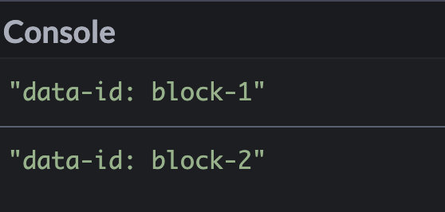
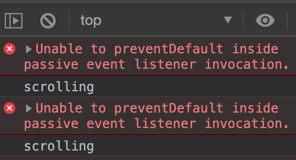
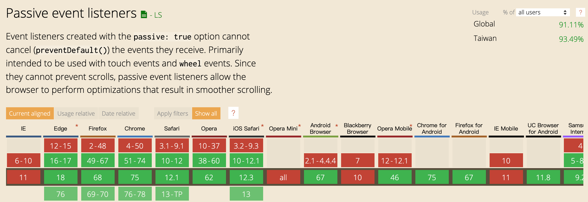
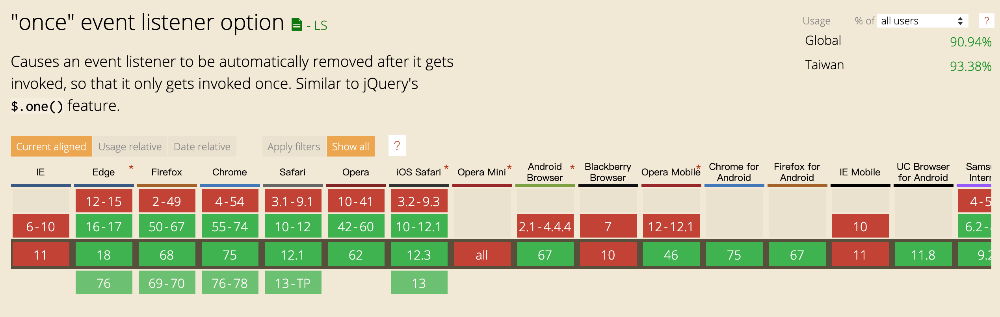
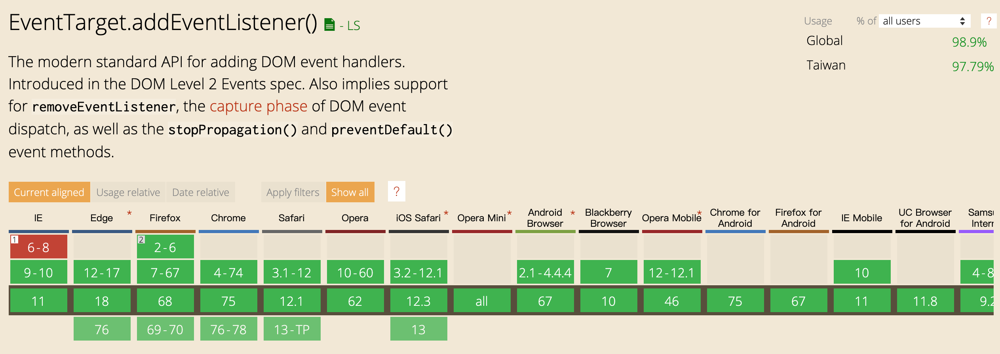

## 前言
開始這個系列的原因，是因為雖然在程式中可能是不影響功能的小事，但卻會關係到整個大系統的流暢度，或是程式碼的簡潔度，這次要提及的是關於javascript與畫面互動最重要的方法，addEventListener，但這次重點不在於元素上有哪些的互動事件（如IE10以後新增的事件transitionend），而是該方法的第三個參數，綁定監聽事件的擴充選項（options）。

根據[MDN](https://developer.mozilla.org/zh-TW/docs/Web/API/EventTarget/addEventListener#Browser_compatibility)文件的記載，綁定監聽事件的選項總共有3+1個屬性，分別為`capture`、`once`、`passive`以及`mozSystemGroup`，本文暫時只收錄前面三項，以下各自介紹其應用情境。

## capture
簡單來說，`capture`屬性能決定同類型事件在巢狀元素的觸發順序，值為`true`是由最外層元素開始，`false`則為最內層元素開始，預設值為false，而使用的時機可能會在希望以群組移動元素的時候使用，以下為範例:

HTML:
```html
<div class="block block-1" data-id="block-1">
  <div class="block block-2" data-id="block-2"></div>
</div>
```
JS:
```javascript
const blocks = document.querySelectorAll('.block');

function handleClick(e){
  console.log(`data-id: ${this.dataset.id}`)
}
blocks.forEach(block => {
  block.addEventListener('click', handleClick, {
    capture: true,
  })
})
```

以上程式碼中，當capture為ture時，印出的值會為：



你可以試試把capture的值更改，看看結果有什麼不同。

## once
`once`，故名思義就是該綁定事件只會觸發一次，其實跟jQuery的[.one()](https://api.jquery.com/one/)方法，在知道這個方法以前，我想許多新手開發者（包括以前的我），都會使用一個開關的變數，或者再使用一個removeEventLisenter方法達到同樣的目的，在知道這選項以後，便不用再這麼麻煩了～

使用範例：
HTML:
```html
<div class="block block-1" data-id="block-1">
  <div class="block block-2" data-id="block-2"></div>
</div>

```
JS:
```javascript
const blocks = document.querySelectorAll('.block');

function handleClick(e){
 console.log(`this event only trigger once, data-id: ${this.dataset.id}`)
}
blocks.forEach(block => {
  block.addEventListener('click', handleClick, {
   capture: true,
  })
})
```

## passive
相對於前面兩個使用上較常見的選項，`passive`（在我的經驗上）則較少使用，passive用於避免對象的原生事件被阻止，並且當事件中偵測到使用`event.preventDefault()`阻止原生事件時，會報錯。
這個選項常用於一些避免網頁無法正常瀏覽的事件類型，例如：`scroll`,`wheel`等，以下是使用場景：

```javascript
function handleScroll(e) {
  e.preventDefault()
  console.log('scrolling')
}

window.addEventListener('scroll', handleScroll, {
  passive: true,
})
```

當運行以上程式碼時，會報出以下錯誤：


## 使用環境與限制
雖然以上的選項都非常方便，但最重要還是在瀏覽器的相容性能否滿足大部分使用者。可惜的是，目前最新的ie版本也並不支援，不過還是可以使用[polyfill](https://github.com/github/eventlistener-polyfill)來進行向下的相容。







以上就是關於addEventListener的第三個參數的介紹，希望大家能夠好好利用這個實用的參數進行開發。