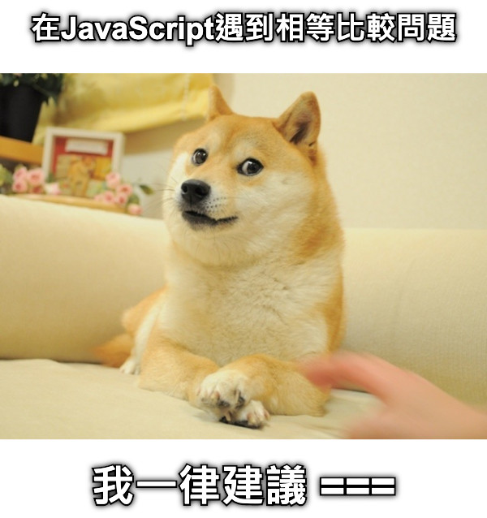
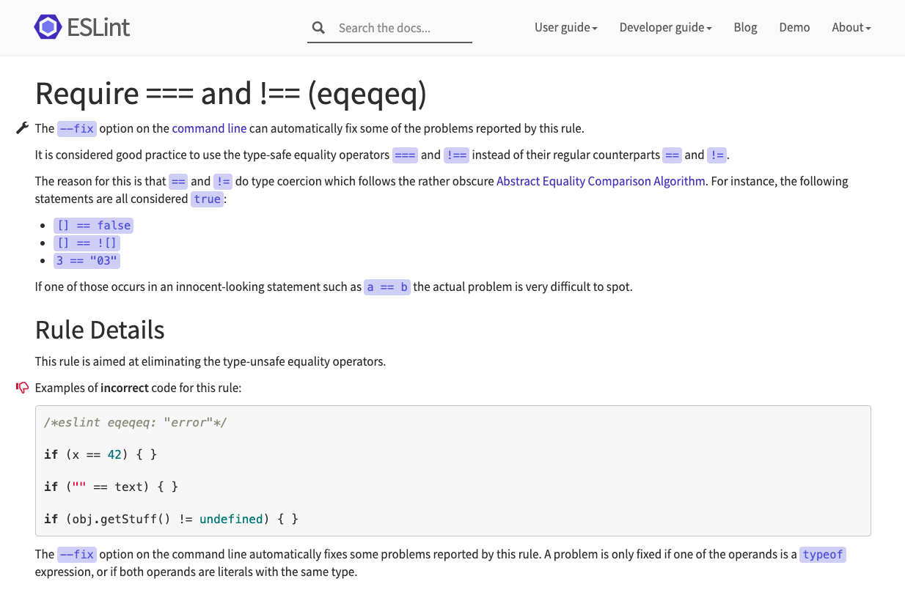
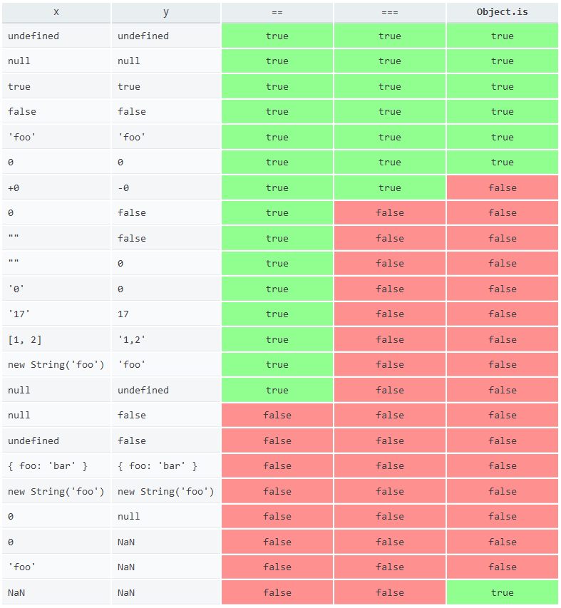

## 前言
這次小事要提及的是關於js中的相等比較，比較是程式用來判斷條件的重要步驟，而在JavaScrip中的等值判斷非常~~有趣~~刺激，使用過JavaScript的開發者都感受過其**抽象相等符**「`==`」的洗禮，大多避免使用「`==`」而改用**嚴謹相等符**「`===`」進行開發。但在開發習慣日漸嚴謹的時代，仍然有`===`也有解決不了的事，這次就來靠近一步看看JavaScript的相等比較吧。



（誤）

## JavaScript的相等比較

在JavaScript中，相等比較主要用於比較基本型別的值是否相等，最常使用的相等比較符號：抽象相等比較符「`==`」**和嚴格相等比較符**「`===`」。
JavaScript是出名的弱型別語言，即其變數的資料型別易於進行轉換，雖然這並非絕對的弱點，但在等值比較時常常會因此出錯，而**抽象相等符**「`==`」便是其受害者之一。

## 抽象相等符「`==`」
抽象相等符對於初學程式的學員來說，是顆裹著糖衣的止痛藥，在香甜的糖衣裡，其實具有很大的副作用，不小心亂服用的話絕對會受苦。

抽象相等符在進行等值比較時，會自動為值進行型別的轉換，讓兩個值能夠在相同的型別下進行比較，例如數字（Number）與字串（String）比較時，會先將數字型別轉換為字串：
```javascript
3 == '3'  //true
```
在這行為下，的確偶而能為夠我們帶來方便，例如在我們需要取得DOM`<input/>`中的value進行比較時，可以跳過型別的轉換進行比較：
```javascript
const age = document.querySelector('#age-input').value;

console.log(age); // '30' 會是字串

if (age == 30) {
  console.log('三十而立')
}
```
但在需要進行比較時，就會出現問題，像是：
```javascript
[] == ![]  // true，最的問題，![]會先轉變為false，[]也因此會在比較時轉為空字串''，最後造成 '' == false 的過程
```
也因此現在很多的開發者都會避免使用 `==` ，而使用**嚴謹相等符** 「`===`」 作為比較相等的符號。

## 嚴謹相等符「`===`」
嚴格相等相對於抽象相等符比較時會包含型別的比較，例如：
```javascript
1 === '1'  // false
1 === true  // false
1 === 1  // true
undefined === null  // false
```

基本上任何的基本型別的值都會相等於自己，除了... `NaN`：
```javascript
'1' === '1' // true
undefined === undefined // true
null === null // true
NaN === NaN  // false，是在哈囉？
```
雖然剛開始會覺得很吊詭，但之後再想想，由於`NaN`並沒有代表任何值，只是代表一個非數值的狀態，所以`NaN`不等於自己，其實也非常合理。

然而除了 `NaN` 這個背骨仔以外，還有 `+0`跟`-0`這對雙胞胎：
```javascript
+0 === -0 // true
0 === -0 //+0另一種表示方式 true
```
幸好平常進行開發時會遇到需要比較正負零的機率非常低，所以我目前把它當作一個冷知識記起來。

原本在ES5以前，就只有`==`和`===`兩個判斷相等比較的運算符，但在ES6後新增了一名新成員：`Object.is()`

## Object.is() （等值比較）
在ES6新增的`Object.is()`方法，甚少為人知道，它的特性並不同於`==`與`===`，可以稱它為「同值相等符」，要，而`NaN`與`+0`,`-0`在它面前，也變成乖孩子了呢。
```javascript
Object.is(NaN, NaN) // true
Object.is(+0, -0) // false
Object.is(0, -0) // true
```
除了以外，`Object.is()`在其它基本型別的比較結果表現基本與 `===` 相同。

## 相等比較符的選擇
從前面的介紹，我們知道ES6後，JavaScript有三種的相等比較符：`==`, `===`, `Object.is()`。但要怎麼去選擇使用呢？

在現在的開發角度，基本上都會推薦使用`===`，主要因為避免自動轉型而讓應用程式遭遇比較的bug，而不選擇使用`Object.is()`的原因，主是是以往開發者已經習慣isNaN()的使用，平常開發也甚少遇到需要精準判別`+0`,`-0`的情景，再加上語法並不直觀，在閱讀程式碼時反而會是個障礙。

目前流行的程式碼分析工具Eslint, 都提供檢查程式碼是否要全面使用`===`代替`==`的規則，在**React**的開發包中便預設加入該規則。



## 總結
- `==` 會自動轉換型別進行比較，結果較不直觀。
- `===` 會先比較型別再進行值比較，結果較直觀，但仍會有`NaN`與`+0`,`-0`特例。目前開發最常用的相等比較符。
- `Object.is()` 是ES6加入的「等值比較符」，連`NaN`與`+0`,`-0`都能準確比較，但寫法不直觀，尚未流行。

### 三種相等比較符的結果表：


## 參考

* [Equality comparisons and sameness - MDN](https://developer.mozilla.org/en-US/docs/Web/JavaScript/Equality_comparisons_and_sameness)
* [Why you should use Object.is() in equality comparison](https://www.jstips.co/en/javascript/why-you-should-use-Object.is()-in-equality-comparison/)