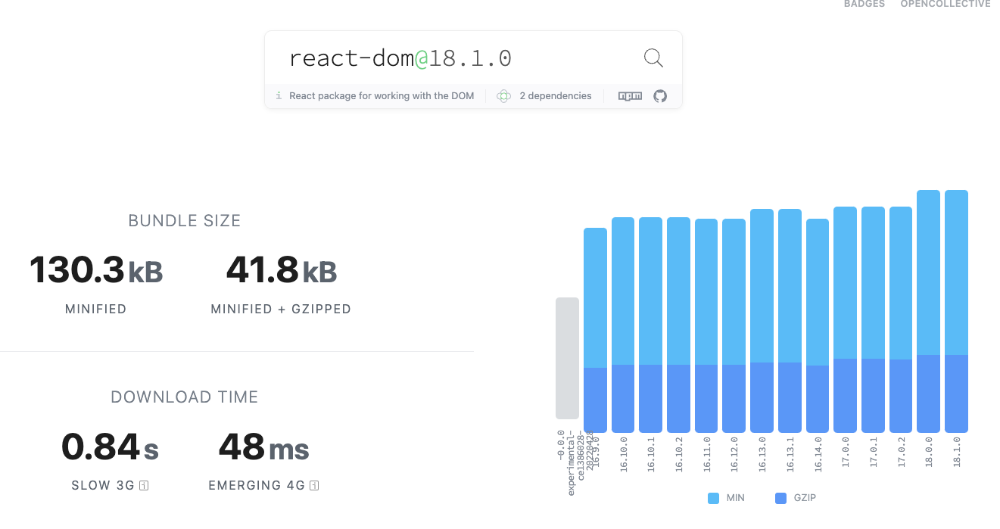

> Svelte 都出來兩年多的框架現在才來玩，有夠慢半拍

## Svelte 是什麼？

Svelte 官網：https://svelte.dev/

現在說起前端框架，基本離不開 Angular，React，Vue 三巨頭，而它們也不固步自封，仍不斷穩步發展。但在前端框架如雨後春筍的時代，不乏新的框架推出，其中儼然是超新星的 Svelte 自 2019 出現後，其後連續兩年排名第四的使用率和第一的滿意度，都可看出 Svelte 對前端開發者的影響力愈來愈大；MDN 的前端框架引導文件更加入了 [Svelte 的教學](https://developer.mozilla.org/en-US/docs/Learn/Tools_and_testing/Client-side_JavaScript_frameworks#svelte_tutorials)。作為前端開發者，也該嘗試一下 Svelte 的魅力何在。

## 過程

基本上一開始先把 [官方文件的教學](https://svelte.dev/tutorial/basics) 流程走了一遍，不得不說教學流程做得很好，包含即時編譯、輸出，幾乎是線上課程平台的等級，走完整個教學差不多需要一個下午（英文能力好的應該會更快）。

起初的開發體驗感覺和 Vue 非常接近，透過 two-way binding 快速實現 UI 的互動功能，並以 component 為單位進行開發。熟悉的 `onMount`、`onUpdate` 生命週期，監聽變數行為的 statements reactively；而眾多的語法糖讓開發者要寫的程式碼異常的少。

看完教學做一個基礎的 todo list，不算樣式只要 33 行完成，也沒有一堆的 this 的使用，非常好閱讀。

<iframe src="https://codesandbox.io/embed/svelte-todo-list-lv5wk0?autoresize=1&fontsize=14&hidenavigation=1&module=%2FApp.svelte&theme=dark"
     style="width:100%; height:500px; border:0; border-radius: 4px; overflow:hidden;"
     title="Svelte todo list"
     allow="accelerometer; ambient-light-sensor; camera; encrypted-media; geolocation; gyroscope; hid; microphone; midi; payment; usb; vr; xr-spatial-tracking"
     sandbox="allow-forms allow-modals allow-popups allow-presentation allow-same-origin allow-scripts"
   ></iframe>

## 特色

### 1. 在 Compiler 的角度處理 DOM 事件

我們都知道（應該吧？）React 和 Vue 都是使用 Virtual DOM 進行判斷渲染，配合各家的 diff 演算法，可減少重新渲染原生 DOM 造成的浪費。這種方式本是美事一樁，但由於 diffing 實際上也需要耗費相當的資源，當 Virtual DOM 內容短時間有大量變動時，在效能較後落的裝置會有效能不足的情況，導致畫面卡頓的情況發生。
結果像 React 又多了 useMemo, useCallback 之類的解法；另外，框架 virtual dom runtime 的 bundle size 也是問題，以 react 為例，react-dom 的bundle 壓縮後，仍要大概 41.8 kB，對網頁的載入速度還是有一定的影響。

為此 svelte 還有[一篇文章](https://svelte.dev/blog/virtual-dom-is-pure-overhead)~~嗆 Virtual Dom~~ 解釋 Virtual Dom 並非絕對快，
而 Svelte 解決以上問題的方式，就是放棄使用 Virtual DOM 而直接操作 DOM，並且把要用的東西都在 compile 階段處理完，不再額外附帶一個框架的 runtime bundle，結果是讓 production 打包得有夠小。以上面的 todo list app 為例，bundle 後的大小只要 6kB。

### 2. 豐富的動畫處理 API

有在 React 上開開動態特效經驗的人，都知道在 React 做動態有多麻煩，先是套件選擇就夠多了，react-spring 、react-transition-group、react-motion... ，相對的 svelte 自帶了各種的動畫 API，其中我最為讚賞的是 `crossfade` 和 `filp`，可以寫很短的程式碼達到以下兩元件間的過渡效果（[範例](https://svelte.dev/examples/animate)），非常適合開發看板類的 UI：

## 總結

說了這麼多，那學 Svelte 會對未來的職涯有幫助嗎？如果你的目標是要找到前端的工作，那我會建議還是找職缺開比較多的框架（React/Vue）去學吧，雖然 Svelte 在週下載量已經達 30 萬，但與三巨頭 React/Vue/Angular 相比，仍然是有一段距離。
然而在新手的學習曲線以及開發者體驗的角度來看，Svelte 可以說是最適合初學者的框架（或編譯器？），我在往後開發中小型專案時，應該會嘗試使用 Svelte，十分推薦大家試試，說不定你一試就喜歡上。

## 參考

* [Svelte 官網](https://svelte.dev/)
* [MDN Svelte 教學](https://developer.mozilla.org/en-US/docs/Learn/Tools_and_testing/Client-side_JavaScript_frameworks#svelte_tutorials)
* [Bundlephobia react-dom@18.1.0 bundle size](https://bundlephobia.com/package/react-dom@18.1.0)
