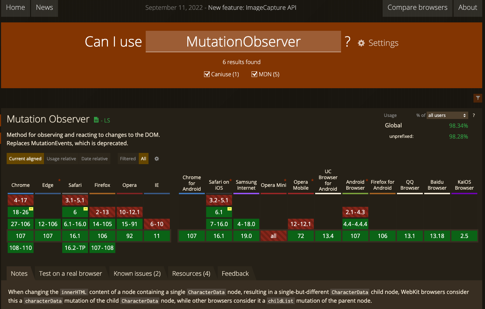

> 你不看我怎麼知道我看你？

網頁前端開發與日俱進，不斷有新的 web API 出現，為前端開發帶來更多不同的可能，今天要為大家介紹的是 **MutationObserver** （[MDN](https://developer.mozilla.org/en-US/docs/Web/API/MutationObserver/MutationObserver)）。

MutationObserver 可以在不相依其他監聽事件的情況下，獨立觀察元素內的節點、屬性及文字內容的變化。它有一個前身：Mutation Event，但由於效能等因素被棄用，到現在以觀察者模式（Observer pattern）重新被實踐，接下來我們來看看要怎麼的使用 MutationObserver 吧！

### MutationObserver 的使用方式

### 1. 建構 MutationObserver 實體

`MutationObserver` 作為一建構子，需要實體化，並傳入一個回傳函式，其函式接受一組包含 **mutationRecord** ([MDN](http://mutationrecord/)) 的陣列，根據 `mutationRecord` 的內容，我們可以取得 DOM 已完成的更動，諸如 DOM 的屬性（`attributes`）或子節點（`childList`）的變化，以及變化前後的值，都可以從 `mutationRecord`取得。

```
const observer = new MutationObserver((mutationRecords) => {
    mutationRecords.forEach((mutationRecord) => {
    switch (mutationRecord.type) {
            case 'attributes':
                console.log('元素屬性變化');
                break;
            case 'characterData':
                console.log('文字內容屬性變化');
                break;
            case 'childList':
                console.log('子節點變化';
                break;
    }
  })
};
```

不知道大家會不會疑惑，為什麼觀察到的變化會是一個陣列呢？那是因為 MutationObserver 的行為是非同步的，待目前所有對 DOM 的變更完成後，才能觸發，藉此避免大量的效能浪費。

### 2. MutationObserver 實體執行 `observe(element, options)`

`options` 有以下的屬性可以使用：

**1. 偵測更動的類型（必須擇一開啟）：**

- `attributes` （Boolean） 偵測屬性的更動
- `childList` （Boolean）偵測子節點的更動
- `charactorData` （Boolean）偵測字元內容更動

**2. 偵測更動的範圍：**

- `subtree`（Boolean）對其節點下所有延伸的節點進行觀察
- `attributeFilter` （String[]）過濾偵測更動的屬性，需要 `attributes` 設為 `ture`

**3. 捕抓更動前的狀態：**

- `attributeOldValue` （Boolean）屬性更動前的值
- `characterDataOldValue` （Boolean）字元內容更動前的值

```
observer.observe(document.body, {
  attributes: true, // 偵測屬性的更動
    subtree: true, // 對其節點下所有延伸的節點進行觀察
})
```

以下是簡單的 playground，可以勾選不同的 option 測試看看：

<iframe height="300" style="width: 100%;" scrolling="no" title="MutationObserver Demo" src="https://codepen.io/alexian/embed/QWxwbeR?default-tab=js%2Cresult" frameborder="no" loading="lazy" allowtransparency="true" allowfullscreen="true">
  See the Pen <a href="https://codepen.io/alexian/pen/QWxwbeR"></iframe>

### MutationObserver 使用時機與實際應用

講解完使用方法，那究竟在什麼實際情況下，會使用上 `MutationObserver` 呢？而我目前使用到 `MutationObserver` 的時機，主要是以下兩個：

### 1. 製作第三方工具

假如你需要製作第三方的工具，例如製作 Chrome extension 時，需要偵測畫面有新元素的加入時，為加入內容進行擴充，這時候便是 `MutationObserver` 發揮所長的時候。

這邊舉個簡單的例子，假如我想為 YouTube 首頁每一個影片縮圖加入提示，假如我在載入頁面後馬上執行，雖然目前的內容有加入成功，但延遲載入加載的內容則無法套用 （為演示方便直接 console 執行）：

使用 mutationObserver 前：


這時候便可以使用 `MutationObserver` 偵測頁面的內容是否有變動，並在變動時對新增的內容（這次例子是影片縮圖）進行操作：

使用 mutationObserver 後：


範例程式碼：

```
const observer = new MutationObserver((mutations) => {
  const imageAdded = mutations.some((mutation) => {
    return mutation.type === 'childList' && mutation.addedNodes.length > 0;
  });

  if (imageAdded) {
    const imageBlocks = document.querySelectorAll('yt-image');

    observer.disconnect();

    imageBlocks.forEach((imageBlock) => {
      if (!imageBlock.dataset.added) {
        imageBlock.after(createLabel());
        imageBlock.dataset.added = true;
      }
    });

    observer.observe(document.body, {
      childList: true,
      subtree: true,
    });
  }
});

function createLabel() {
  const label = document.createElement('div');
  const styles = {
    position: 'absolute',
    left: '5px',
    top: '5px',
    backgroundColor: '#22ff44',
    width: '20px',
    height: '20px',
    borderRadius: '20px',
  };
  Object.assign(label.style, styles);

  return label;
}

observer.observe(document.body, {
  childList: true,
  subtree: true,
});
```

### 2. 內容編輯器

前端的大家應該對元素的 contenteditable 屬性並不陌生，對於取得因 contenteditable 而變更的內容，通常會使用 [input 事件](https://developer.mozilla.org/en-US/docs/Web/API/HTMLElement/input_event) ，但如果要以 contenteditable 為基礎製作內容編輯器時，其元素內會有多層的元素結構，當要比對更新的內容時會非常不便；這時也可以考慮使用 `MutationObserver` 進行實作，便可以快速找到是哪一個元素的內容觸發更新：

<iframe height="300" style="width: 100%;" scrolling="no" title="MutationObserver for content editor" src="https://codepen.io/alexian/embed/dyKWLpq?default-tab=js%2Cresult" frameborder="no" loading="lazy" allowtransparency="true" allowfullscreen="true"></iframe>

### MutationObserver 的注意事項

作為觀察者模式 API，MutationObserver 給予我們監聽元素內容變動的機制，便於對第三方內容進行後處理；在團隊的應用上，也可以做出如 [CustomEvent](https://www.notion.so/MutationObserver-DOM-f64fbf741dd1449db4dd3bd1fd6c02b0) 有助減少程式藕合的開發體驗。

另外，對於進行觀察的元素，應該儘可能把範圍限縮，如上面第一個實作的範例，就可以從 `document.body` 限縮至右側的主內容 `#content`，對於執行 `oberver()` 時，也可以限縮觀察的選項，減少不必要的 callback，以利節省效能。

而在瀏覽器相容性方面，連被停止支援（放逐）的 IE 11 也適用，所以可以放心使用：



經過以上介紹，希望能讓大家能多認識 **MutationObserver** 這個 API ，並活用於前端開發上喔。

### 參考

- [MDN MutationObserver](https://developer.mozilla.org/en-US/docs/Web/API/MutationObserver/MutationObserver)
- [https://stackoverflow.com/questions/14564617/when-are-mutationobserver-callbacks-fired](https://stackoverflow.com/questions/14564617/when-are-mutationobserver-callbacks-fired)