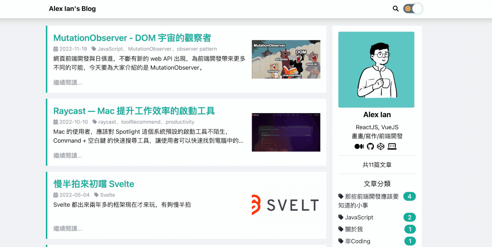
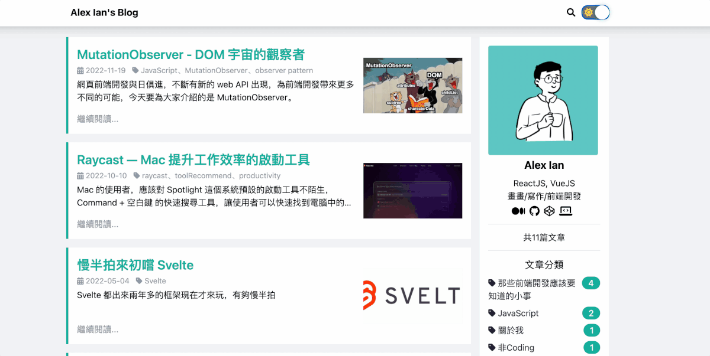
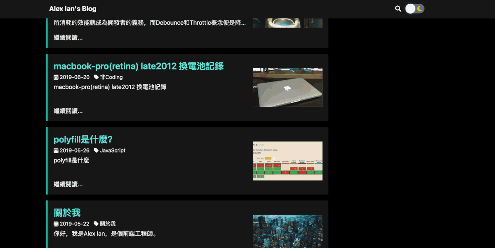

> 首先把 Blog 連結貼在最前面：[https://alex-ian.me/](https://alex-ian.me/)

許多工程師（包括我）都會寫筆記或部落格，作為學習歷程記錄；市面上有很多實用的寫作工具，如 Blogger、Notion、Medium，而前端工程師為了技術的展現，除了使用以上的平台外，通常會架設自己的部落格，而且一定要用些聽起來比較新潮的技術，（畢竟前端工程師不能隨便把 SEO 和流量白白送給別人，假設哪天自己流量大了，還可以上廣告補貼家計，所以我們必須自己架站）。以下是我在最近更新個人部落格的一些記錄，先列出目前使用的 tech-stack：

- [Github](https://github.com/) (storage)
- [Netlify](https://www.netlify.com/) (CI / CD)
- [Gatsby.js](https://www.gatsbyjs.com/) (靜態網站 framework)
    - [React.js](https://reactjs.org/) / [Tailwind CSS](https://tailwindcss.com/) / [GraphQL](https://graphql.org/)

就這麼少，真的這麼少。

我架設部落格所使用的是 [Calpa](https://github.com/calpa) 使用 Gatsby 所建的部落格樣版，Gatsby 是一個使用 React.js 作為基底的靜態網站生成器，支援多種資料來源，並使用 [GraphQL](https://graphql.org/) 進行資料請求，它也提供了多元的 plugin，file-system、lazyload image 等應有盡有，也可使用 Github 作為儲存空間，大大降低了建站的門檻和痛點。

當初使用樣版後，對於外觀之類的都沒有做更動，甚至沒有使用原本支援的 Netlify CMS ，都是使用傳統的 markdown 檔做內容的變更。 直到前陣子換工作期間的閒暇，想要把部落格更新成自己想要的樣子，於是就有以下的記錄（更新早好了，但文章拖了幾個月哈）。

## 一、更新套件

自從更換成 m1 pro 的 MacBook 後，除了開發工具需要更新，許多以前的 project 都有塵封已久的問題，而問題大概都離不開套件版本過舊，無法編譯和執行，這個部落格當然也不例外。於是更新套件變成首要工作，使用強者前同事指導的套件更新要訣：

> 去 yarn 查套件最新的版本去更新，發現跑不動再去查文件有沒有 breaking change.
> 

說來也有點幸運，更新過程基本上沒有遇到什麼大問題，只是有些套件的 migration 文件有點難找，在這邊大概列一下我這次更新遇到的卡點：

- Gatsby 2 → 3 : 多了一個 src/api folder 的 [保留限制](https://www.gatsbyjs.com/docs/reference/release-notes/migrating-from-v2-to-v3/#srcapi-is-a-reserved-directory-now)，如果該 directory 底下有需要 compile 的東西 (例如 React )，就會在起 dev server 時報錯，改個名字就可以解決
- Lint-staged 8 → 12 ：不能直接在 package.json 直接使用 advance configuration ([release note](https://github.com/okonet/lint-staged/releases/tag/v9.0.0))

## 二、可用工具的替換

當專案可以重新啟動，接下來的步驟就是汰舊換新，一些原模板使用到的工具，因各種考量（例如： 資安、新版功能等）下進行替換，畢竟前端工程師就是喜新厭舊。

### 1. 使用 utterances 替換 gitalk

[utterances](https://utteranc.es/) 是一個使用 GitHub Issue 功能作為留言版的工具。他的特點是使用簡單且安全。

由於 gitalk 需要把 Github 的 key 放到 repository 內，對資安有一定風險，utterances 只需要 Github App 的授權，不需要把 key 外露，也有不同的 Theme 使用，是很不錯的替換方案。

用法也是非常簡單，只需要 [放入 script tag](https://utteranc.es/#heading-enable) 即可：

```jsx
<script
	src="https://utteranc.es/client.js"
  repo="[ENTER REPO HERE]"
  issue-term="pathname"
  theme="github-light"
  crossorigin="anonymous"
  async
></script>
```

它更提供的 postMessage 事件來實現 theme change 的情景（可配合黑夜模式）：

```jsx
iframe.contentWindow.postMessage({
  type: 'set-theme',
  theme: 'github-dark',
}, 'https://utteranc.es');
```

### 2. 使用 Tailwind 替換 Bootstrap Style

[Tailwind](https://tailwindcss.com/) 是一個使用 util CSS (或稱 functional CSS) pattern 實作的 CSS framework，特點是輕量，熟悉後能快速修改和套用。 

由於聽說 Tailwind 已久，但還沒在實務中使用過，於是藉這個機會實際應用。第一次使用 Tailwind 時，的確會被過長的 className 所勸退，但配合 React 的 Component Pattern，實際上會直接看到長長一串的 className 機率是很低的，post processor 也讓 CSS 變得更小，在製作 Dark Mode 上更是超級方便（後面會再詳述）。

不過由於我的文章內容使用 markdown 格式，tailwind 無法保留未知的樣式，所以我對部落格文章另外寫了一份 scss，來填補 Tailwind 這部分的不足。

## 三、新增功能

作為前端工程師，對於 UX 的要求也是非常高的，但凡部落格可以優化但還沒實作的工具，都想要在自己的部落格中實現，於是實作了以下肖想已久的功能：

### 1. 站內即時搜尋器 Algolia Search

Algolia 是可以對靜態網站做即時搜尋的工具，當部落格文章越來越多的時候（真希望我可以有那個時候），有搜尋的工具就顯得很重要，對於 Gatsby 來說，有專門的 Algolia plugin ，設定上非常簡單



### 2. 黑夜模式

作為工程師，之前一直想找機會練習實作 Dark Mode，使用 Tailwind 對其設定更是方便；這個部分的難點在於對 dark mode 顏色的掌握（往 UI 的部分走歪）



### 3. 延遲載入圖片

Gatsby 在圖片處理的部分有很多實用的 plugin，配置也相當的簡單，大概列出會用到的 Gatsby 套件：

- `**gatsby-plugin-sharp**`：底層套件，提供 gatsbyImageData 和處理圖片 render
- `**gatsby-transformer-sharp**`：底層套件，配合 `gatsby-plugin-sharp` 將圖片轉換為 `ImageSharp` 節點
- `**gatsby-source-filesystem**` ：處理檔案節點，通常配合 `gatsby-transformer-json` 或 `gatsby-transformer-remark` 把檔案轉換成可被 Gatsby 使用的格式
- **`gatsby-plugin-image`** ： Gatsby 處理圖片的套件，進行預處理（生成延遲載入圖…）
- **`gatsby-remark-images`**：用於處理 markdown 格式中使用的圖片

透過以上的 plugin 便能快速達成 lazyload 圖片的效果，不過要注意是目前檔案類型只支援 jpg 與 png，gif 是沒辦法使用的。



### 4. 使用 Netlify-CMS 建立後台

Netlify-CMS 是 Netlify 提供的內容管理器，透過 git flow 進行儲存，簡單來說可以讓你有一個文章管理後台。這早就在原有部落格模版下，但我一直沒有使用過，在這之前都一直使用 vscode 當文章的編輯器，後來想想，有現成的工具為何不使用呢？

## 後記：待辦事項

雖還有很多想做事，但礙於時間限制沒能做來得及做的東西，留一個記錄，待自己回頭看，可以慢慢的完成（希望啦）

### 1. 使用 TypeScript 替換 PropTypes

在寫 propsTypes 時，真的很冗，defaultProps 還要額外寫，實在很不方便、很不工程師，所以打算導入 TypeScript，但想到要花費的時間會很長，就先放著了。

### 2. Netlify-CMS 與 圖片資源整合

使用 Netlify-CMS 後，在編輯內容的介面有很好的提升，但在使用圖片上，還是有些不便的地方；例如無法從部落格預覽頁面顯示對應的圖片、或是在部落格編輯頁搜尋圖片，這些都會影響到 UX 體驗，希望以後可以找到解決方法。

## 參考資料

- [Gatsby migrate V2 to V3](https://www.gatsbyjs.com/docs/reference/release-notes/migrating-from-v2-to-v3/#srcapi-is-a-reserved-directory-now)
- [Calpa 的部落格新手包](https://github.com/calpa/gatsby-starter-calpa-blog)
- [我魔改的後的部落格包](https://github.com/aforian/gatsby-starter-calpa-blog)