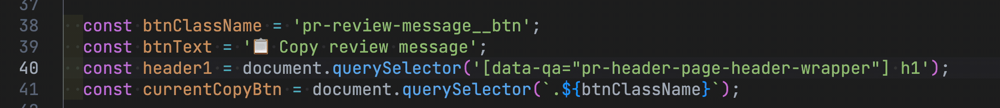
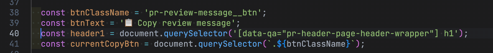
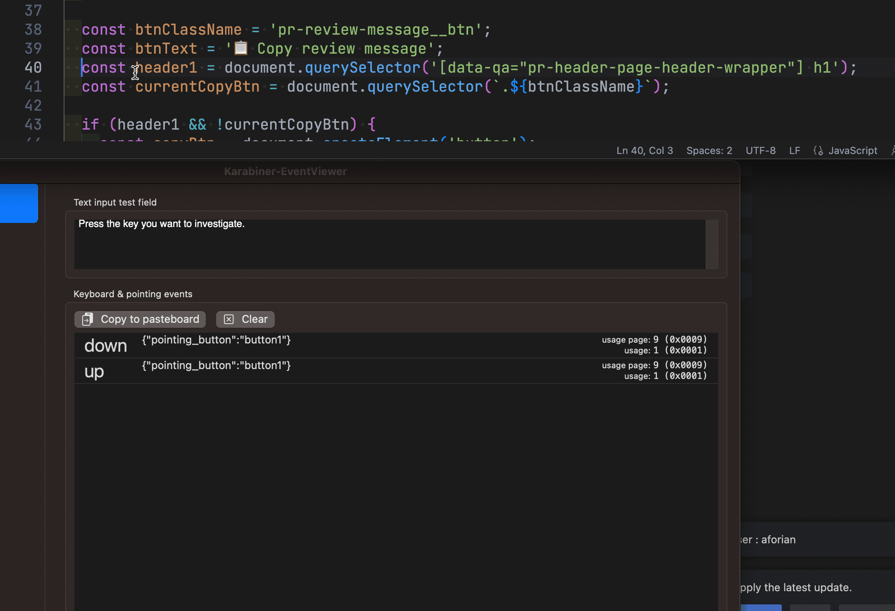

我國中的電腦課，會教導學生倉頡和速成輸入法，並且每年都會有打字速度比賽，有趣的是，每屆比賽的冠軍，都是使用倉頡輸入法的同學，有時甚至前三名都由倉頡輸入法包辦；想要找出原因，我們可以稍微觀察一下兩個輸入法的差異，先看看輸入的方式：

* 倉頡：2~5 碼 + 空白鍵
* 速成：拆解首尾 2 碼 + 看頁數並選取字碼

只看輸入的方式，兩者在按鍵數量上相差不大，但速成需要切換頁數並檢視序號，輸入花費的時間較長。那我們從另一個角度，學習的成本來檢視：

* 倉頡：需要記住字的寫法，且每個字元幾乎有單獨的拆碼方式
* 速成：需要記住字的寫法，但只需拆頭尾兩碼

前面兩個維度的考量，實際上就是「**輸入操作**」和「**記憶負載**」。**輸入操作** 指的是輸入每個碼的按鍵，以及按鍵後需要花費的精神與時間；**記憶負載** 則是指使用者需要記住多少字的拆字碼，以及該碼的順序。輸入操作和記憶負載都是輸入法效率必須考慮的議題，並且在不同的輸入法中，二者可以有不同的折衷方式。例如，在速成輸入法中，使用者可以透過簡單字碼避免記憶負載，但可能需要付出更多的輸入操作；然而，在倉頡輸入法中，則需要使用者記住完整的拆碼，但可以降低輸入操作的成本。

我認為付出一定程度的**記憶負載**換取**輸入操作**，對於程式開發效率有著重要的影響。而實現記憶負載最實際的方式，就是「快捷鍵」。

## 快捷鍵（記憶負載）對開發效率的提升

快捷鍵可以讓開發者不用再去記住每一個操作步驟，只需要記住鍵位對應的功能，就可以進行操作，就如同大家在打字時，對於一些常用的按鍵功能，像是方向鍵、 enter 鍵、 tab 鍵，都能非常順暢的操作，而不需要去思考如何操作；同樣的，在程式開發中，有了快捷鍵的支援，就可以大幅提升程式開發的效率。以 vscode 選取一行程式碼為例，你可以使用以下的方式：

1. 方法 1 - 滑鼠選取

   

2. 方法 2 - 鍵盤快捷鍵 1 - `shift + →` * n 次 or 按住

   

3. 方法 3 - 進階鍵盤快捷鍵 - `cmd + shift + →`

   

大家可以很明顯看出，方法 3 應該是最快速也最安全的方式，只需要一個組合鍵，不用擔心沒有完整選取或是超過選取的錯誤，而在程式開發上，選取單行的機會並不少，一次次使用快捷鍵操作而累積下來節省的時間，絕對非常可觀。

VScode 提供了非常豐富的快捷鍵，坊間很多不同的文章和影片可供學習，官方也有[提供 pdf 參考](https://code.visualstudio.com/shortcuts/keyboard-shortcuts-windows.pdf)；如果你不滿足官方提供的快捷鍵，也可以在 **導覽列： Code → Preferences → Keyboard Shortcuts** 檢視並自訂快捷鍵。

接下來讓我們回頭看看方法 1 與方法 2 ，雖然兩者孰快孰慢則有討論的空間；你可能會說，這不是很明顯是 1 比較快嗎？實際上，方法 1 的操作步驟有一個盲點。

## 使用滑鼠的成本

我們先看一下方法 2 的步驟：

1. 按住 `shift + →`

接下看看使用滑鼠選取單行內容的行為，我們可以拆分為三個步驟：

1. 把手從鍵盤移至滑鼠 or 觸控板
2. 操作滑鼠 or 觸控板選取內容（按住滑鼠左鍵/觸控板拖動對應距離）
3. 把手從滑鼠 or 觸控板移回慣用鍵位

大家在實際操作時，通常會忽略 1 & 3 的操作成本，我們在進行文字輸入時，雙手應該都在鍵盤的鍵位上，一旦需要選取內容，手的位置就要來回移動，因此當你頻繁去切換手的位置時，需要消耗相當的時間和注意力；另外，操作滑鼠進行操作時所需要的精細度，也需要消耗開發者的注意力。所以減少滑鼠操作的次數， 對開發效率會有一定的提升。

然而鍵盤輸入實際上還有進步的空間。

## 方向鍵的成本

精明的讀者可能會發現，因為鍵盤配置的問題，實際上在操作 `shift + →` 時，右手仍然需要稍微往右下移動，才能觸及方向鍵，這樣不就沒有解決使用滑鼠的痛點嗎？

### 方向鍵的解方

外接鍵盤有很大的市場，而鍵盤有許多不同的配置，100%，75%，等，當中能夠最精簡輸入全部內容的佔比，是 60% 的鍵盤配置：

source: [keychron k12](https://www.keychron.com/pages/keychron-k12-compact-wireless-60-layout-mechanical-keyboard-2)

可以看到 60% 的鍵盤配置，可以在你的雙手放在鍵盤時，只移動手指觸及所有的按鍵，而這種配置的鍵盤，並不包含方向鍵，取而代之的是使用組合鍵（`fn2` + `l` or `m` or `,`  or `.`）來實現輸入方向鍵，以這種方式，便可以在不移動雙手的情況下，按出需要方向鍵的快捷鍵。

不過，要實行組合鍵不一定需要買外接鍵盤，可以改用自訂按鍵的軟體實作。

### 改鍵軟體 Karabiner-Elements

Karabiner-elements （<https://karabiner-elements.pqrs.org/>）是開源的改鍵軟體，透過 Karabiner-elements 可以進行自訂按鍵的設定。

1. 安裝完成後啟動軟體，前往 **Complex Modifications → Add rules** ，

   

2. 找到 `Change right_command+ hikl to arrow keys` 項目，點擊 Enable ，便可以使用右 `cmd + h,j,k,l` 輸入方向鍵（h, j, k, l 分別代表 左，下，上，右）

   

3. 回到 vscode ，如果想要輸入 `cmd + shift + →` 按住 `左 cmd` + `shift` （左手）和 `右 cmd` + `l` （右手）便可以實現操作

   

除了軟體提供的組合鍵例子，你也可以在 <https://ke-complex-modifications.pqrs.org/> 找到其他開發者上傳的組合鍵巨集；如果你還是不滿意，也可以透過 [GUI 編輯器](https://genesy.github.io/karabiner-complex-rules-generator/) 或 [程式碼](https://github.com/pqrs-org/KE-complex_modifications) 方式建立屬於你自己的組合鍵。

## 總結

**輸入操作** 和 **記憶負載**，概念上和演算法的時間 & 空間複雜度有莫名的相似，透過空間的提升，節省運算的時間。

因為記憶負載影響，第一次使用組合鍵輸入、或是花時間回想快捷鍵進行操作時，都一定會感覺非常不習慣，但只要經過一段時間的刻意練習後，就能夠順暢使用快捷鍵與組合鍵，省去再花時間去移動滑鼠和實現操作時間，並且大幅提升程式開發的效率。

### 資源

* <https://code.visualstudio.com/docs/getstarted/keybindings>
* <https://karabiner-elements.pqrs.org/>
* <https://ke-complex-modifications.pqrs.org/>

*(本文由 notion AI 輔助完成）*