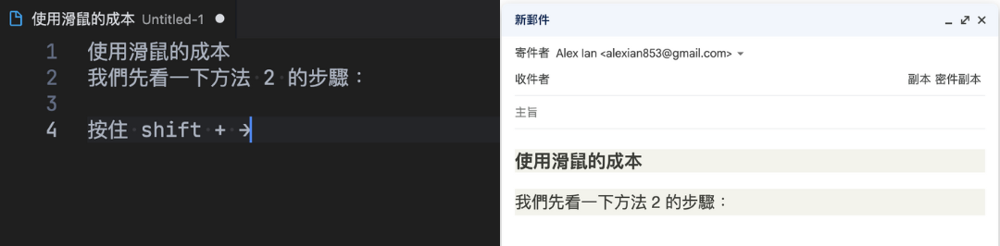
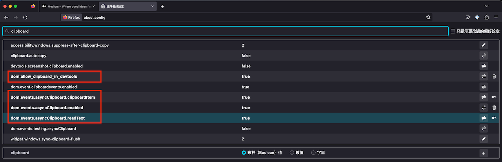

## 前言

平常在使用一些內容編輯的應用如 Notion、Slack 時，只要全選內容，就可以輕鬆複製包含格式的內容到剪貼簿，或者在一些教學文件按一下  📋 圖示，就能把資料複製到剪貼簿；但是你有沒有疑惑過，你複製的網頁內容，為什麼會在不同的應用貼上時，產生了不一樣的結果呢？今天就來看看，你究竟複製貼上了什麼。

## 實地考察

要看到複製的內容是什麼，我們可以使用瀏覽器實作的 [Clipboard API](https://developer.mozilla.org/en-US/docs/Web/API/Clipboard_API) ，先打開 Chrome 的開發者工具，貼上以下程式碼，但先不要執行（避免你最後複製的內容，是這段程式碼 😂）：

```jsx
// 由於 navigator.clipboard 必須在網頁在 focus 的狀態，故延遲 3 秒讓你重新 focus 網頁
setTimeout(() => {
    navigator.clipboard.read().then(t => console.log(t))
}, 3000);
```

接下來我們試著在 Medium 的文章中使用複製包含連結/格式的內容，複製好後執行我們前一個步驟輸入的程式碼（會需要允許存取 `clipboard-read` 權限），執行後要再點擊網頁可以看到你在剪貼簿的內容：


複製的內容會是一個包含 `ClipboardItem` 實例的陣列，而 `ClipboardItem` 實例又可以帶有多個**媒體類別** (**\*\*MIME type\*\***)的內容，如 `text/plain` 、`text/html` 、`image/png` 等。像前面範例所複製的內容，就包含 `text/plain`、`text/html` 兩個媒體類別，分別作用於不同的貼上情境。

例如在純文字編輯器內執行貼上，系統會使用 ClipboardItem 中 `text/plain` 格式的內容貼上；而一些郵件編輯器中，則會貼上 `text/html` 格式的內容，但最終貼上的內容還是要視乎應用程式的設計而定。



## 使用 Clipboard API 動態寫入內容

### 純文字的內容

有讀取的方法，自然就有寫入的方法，先來看最簡單的 `navigator.clipboard.writeText()` 方法，只需要傳入要複製的字串內容即可（[Codepen 範例](https://codepen.io/alexian/pen/WNgKjzG)）：

```jsx
$copyBtn.addEventListener('click', () => {
  navigator.clipboard.writeText('這是寫入剪貼簿的內容');
});
```

另外，`navigator.clipboard.writeText()` 會回傳 Promise ，所以可以實現複製成功後的事件處理 （[Codepen 範例](https://codepen.io/alexian/pen/YzOjYdL)）：

```jsx
$copyBtn.addEventListener('click', async () => {
  await navigator.clipboard.writeText('這是寫入剪貼簿的內容！');
  
  $notice.textContent = '已複製!';
  setTimeout(() => $notice.textContent = '', 2000);
});
```

### 其他**媒體類別**的內容

相對於純文字的內容，要把其他媒體類別的內容放入剪貼簿相對較複雜，首先要使用的方法為`navigator.clipboard.write()`，該方法接受一個只有 `ClipboardItem` 項目的陣列（但直到目前為止各大瀏覽器的寫入剪貼簿實作 `navigator.clipboard.write()` ，只能帶入單個 `ClipboardItem` 至陣列中 — [來源](https://developer.mozilla.org/en-US/docs/Web/API/Clipboard/write#example_of_copying_canvas_contents_to_the_clipboard)），接受一個物件作為參數，屬性是對應檔案大一月金型只接受 [Blob](https://developer.mozilla.org/zh-TW/docs/Web/API/Blob) 實例，假如要塞入 HTML 內容，就要建立對應的 `text/html` 媒體類別的 **Blob** 實例 ([Codepen 範例](https://codepen.io/alexian/details/qBMyxZY))：

```jsx
$copyBtn.addEventListener('click', async () => {
  const clipboardItem = new ClipboardItem({
    "text/html": new Blob(
      ['<h1>這裡是 HTML 內容</h1><p>想不到吧！</p>'],
      { type: "text/html" },
    ),
  });

  await navigator.clipboard.write([clipboardItem]);
});
```

和 `navigator.clipboard.writeText()` 一樣，`navigator.clipboard.write()` 會回傳 Promise；另外，如果貼上的區塊需要媒體類別不存在於剪貼簿中，會沒有內容可以貼上；想解決這個問題，可以讓 `ClipboardItem` 攜帶多個媒體類別的內容 ([Codepen 範例](https://codepen.io/alexian/pen/OJowQpL))：

```jsx
$copyBtn.addEventListener('click', async () => {
  const clipboardItem = new ClipboardItem({
    "text/plain": new Blob(
			['純文字內容在這裡！'],
			{ type: "text/plain" },
		),
    "text/html": new Blob(
			['<h1>這裡是 HTML 內容</h1><p>想不到吧！</p>'],
			{ type: "text/html" },
    ),
  });

  await navigator.clipboard.write([clipboardItem]);
    
  $notice.textContent = '已複製!';
  setTimeout(() => $notice.textContent = '', 2000);
});
```

## 應該現在就使用嗎？

以往要在 JS 中實現複製行為，通常會使用 `execCommand(’copy’)`，但由於安全性有疑慮（無法檢查使用者複製內容是否安全）、以及實用性不足（無法複製除 `text/plain`，`text/html` 以外的格式）的原因；而 **Clipboard API** 就是為了補足前者缺失而製訂的 API，除了可以放入圖像 `image/png` 、`image/jpg` 以外，更可以放入自訂的**媒體類別** [來源](https://developer.chrome.com/blog/web-custom-formats-for-the-async-clipboard-api/#writing-web-custom-formats-to-the-clipboard) ，取得更多樣的複製內容。

聽起來應該要全面使用它進行實作，但其實還是有些疑慮。

### 不太好的通用性

理想很豐滿，現實很骨感。雖然 W3C 制訂了 **Clipboard API** 的標準，但在瀏覽器權限上，firefox 走出了和其他瀏覽器不一樣的路：

1. 預設不能使用 `navigator.clipboard.read()` （需要在 `about:config` 介面打開 **`dom.events.asyncClipboard.read`** 選項）
2. 預設不能使用 `navigator.clipboard.write()` （需要在 `about:config` 介面打開 **`dom.events.asyncClipboard.write`** 選項），而且打開後，只能使用 `DataTransfer` 實例代替 `ClipboardItem` 放入內容
3. 87 版後新增了 `ClipboardItem` 但預設不能使用（需要在 `about:config` 介面打開 **`dom.events.asyncClipboard.clipboardItem`** 選項）



也因此導致  **Clipboard API** 的通用性不夠全面，需要為不同瀏覽器進行調整，也就影響了使用它的意願。

### 什麼開發情境適合使用呢？

Clipboard API 在 Chromium 上有較完整的實現，如果你使用的平台是 Chrome 例如在開發 Chrome extension，或是 Electron（Chromium Based）應用，那麼就可以大膽的使用它。

## 同場加映 - **ClipboardEvent**

Clipboard API 對使用 JS 動態存取剪貼簿非常實用，但如果使用者在網頁中使用系統原生的複製、貼上功能，則可以使用 `copy` 、`paste` 事件來進行監聽，例如有一些討論區會在你複製內容時，在結尾加入 *來源於 xxx* 的字句，這時就可以用 `copy` 事件：

```jsx
document.addEventListener('copy', function(event) {
  const selectedText = window.getSelection().toString();
  event.clipboardData.setData('text/plain', `${selectedText} 來源於: Alex`);
  event.preventDefault();
});
```

若要根據在使用者執行貼上時對其內容進行處理，則可以用`paste` 事件：

```jsx
document.addEventListener('paste', function(event) {
  const pastedText = event.clipboardData.getData('text/plain');
	if (pastedText.includes('Alex')) {
    console.error('這內容有毒！');
  }

  event.preventDefault();
});
```

## 總結

本文介紹了 Clipboard API，可以讓開發者動態存取剪貼簿內容，並支援多種媒體類別。然而各家瀏覽器對其支援程度有所差異，因此通用性還有待改善。此外還介紹了 `copy` 和 `paste` 事件，可以用來監聽使用者在網頁中使用系統原生的複製、貼上功能。

如果有錯漏或是不理解的地方，歡迎指正或留言一起討論喔！

## **參考來源**

* [MDN - Clipboard API](https://developer.mozilla.org/en-US/docs/Web/API/Clipboard_API)
* [MDN - ClipboardEvent](https://developer.mozilla.org/en-US/docs/Web/API/ClipboardEvent)
* [Google Developers: Async Clipboard API](https://developers.google.com/web/updates/2018/03/clipboardapi)
* [Web custom formats for the Async Clipboard API](https://developer.chrome.com/blog/web-custom-formats-for-the-async-clipboard-api/#writing-web-custom-formats-to-the-clipboard)