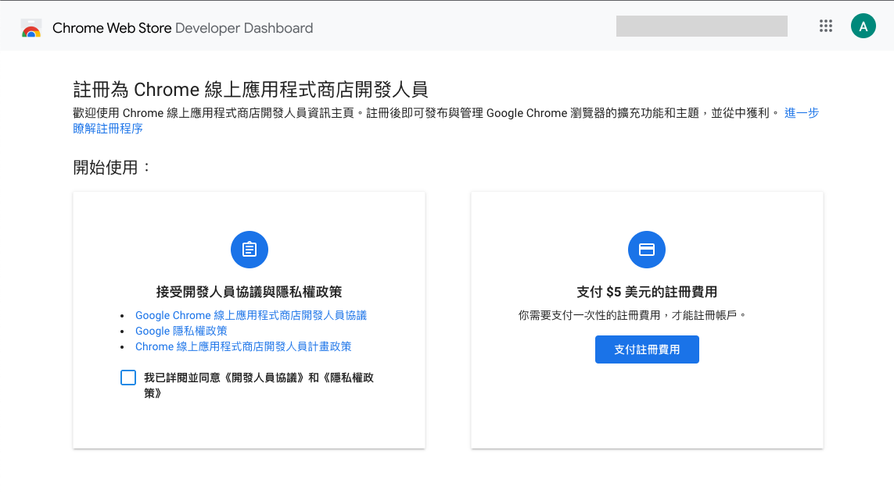
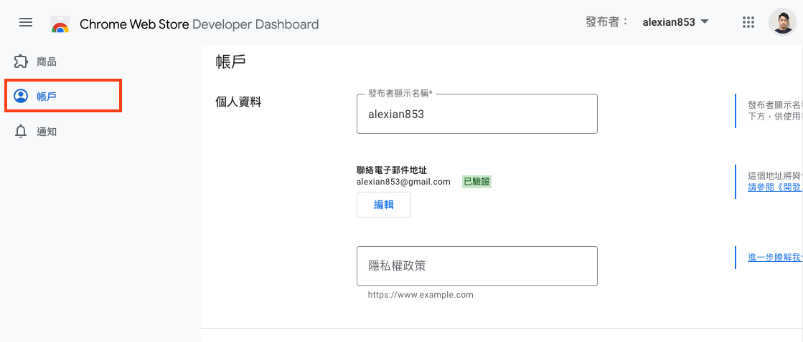
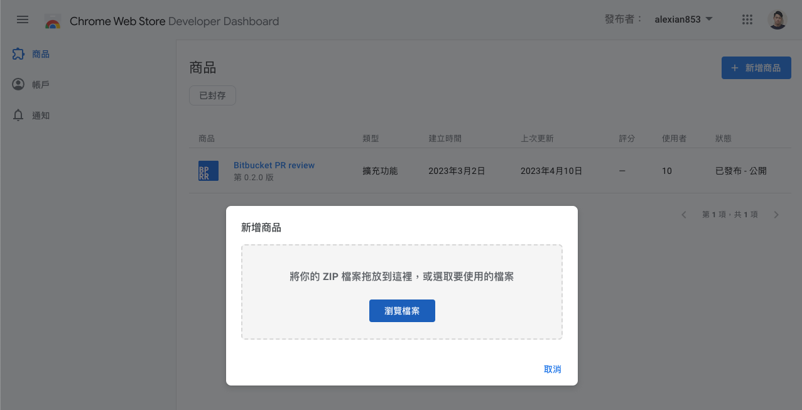
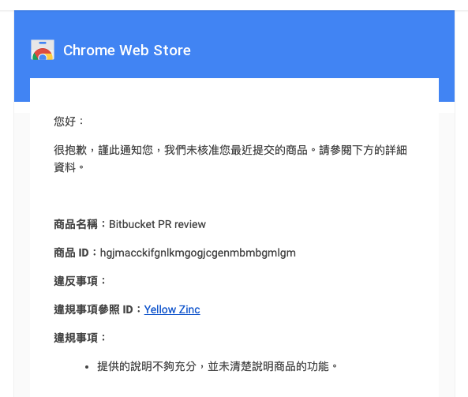
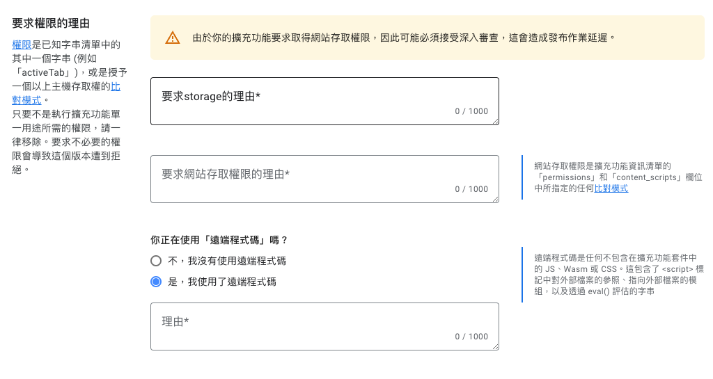
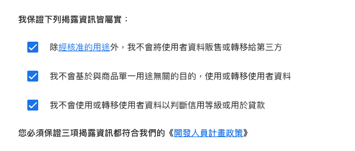
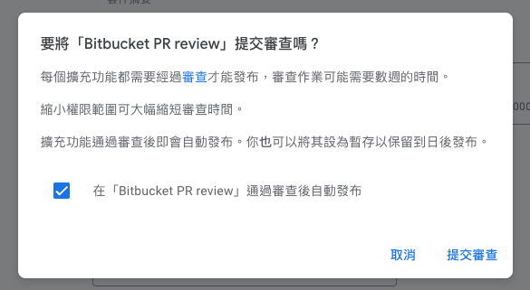

上回提到我們在本地端建好一個開發版本的 Chrome extension 後，接下來要怎麼讓它上架到商店上讓別人直接安裝呢？其實 Chrome 已經寫好一個 [手把手的教學](https://developer.chrome.com/docs/webstore/publish/#setup-a-developer-account)，基本步驟如下：

1. 提供 extension 打包的 zip 壓縮檔
2. 建立一個 Chrome 線上應用程式商店的開發人員（**Chrome Web Store developer**，太長了，後面我們簡稱 CWS 開發人員）帳號
3. 上傳你的 extension 並填寫相關資料
4. 提交並在審核成功後上架

~~文章就到這裡謝謝，~~這邊讓我們~~從頭開始~~以上次開發的 extension 實際走一遍（詳情可以看我上一篇 [從頭開始學習開發 Chrome extension （v3 版本）](https://alex-ian.me/2023-04-05-learn-chrome-extension)）

## 一、把 Chrome extension 打包成 zip 壓縮檔

Chrome 對於打包的 extension，`manifest.json` 有欄位的要求， 在打包之前，我們需要確定有 extension 的內容有沒有符合，必須填寫的屬性有：

- `"name":` extension 的名稱，會作為名稱顯示在商店中，搜尋時也會以名稱為優先
- `"version":` extension 的版號，可以提供使用者更新的資訊
- `"icons":` extension 的圖示，安裝後會顯示於工具列上
- `"description":` extension 的描述，會顯示在 extension 的安裝資訊上

回頭看看我們的 `manifest.json` ，目前缺少了 `icons` 和 `description`。

### icons

首先來看看 `icons`，由於時間關係，我已經先準備好 [範例的圖片](https://github.com/aforian/bitbucket-pr-review-message/tree/7251f730dd07f5fef7e1cfd464cd0e69e4fc9989/assets/images) 可以下載。可以在我們的專案目錄建立 `assets/images/` 巢狀資料夾，並把圖片放到資料夾中，同時更新 manifest.json：

```jsx
{
  // ...
	"icons": {
    "16": "assets/images/icon-16.png",
    "32": "assets/images/icon-32.png",
    "48": "assets/images/icon-48.png",
    "128": "assets/images/icon-128.png",
    "400": "assets/images/icon.png"
  }
}
```

可以看到在 icons 屬性中，可以提供不同大小的圖片，Chrome 會根據不同的情境使用不同大小圖示，例如在工具列會使用 16x16，在應用程式商店會使用 128x128，但假如你設定一個尺寸的圖示，Chrome 也會自動幫你做縮放處理，所以不用太執著。

### description

再來看看 `description` ，設定相對簡單，只要填寫不超過 132 字元的純文字來描述 extension 的功能即可：

```jsx
// manifest.json
{
	// ...
	"description": "Create PR review message with template"
}
```

另外 `description` 和 `name`可以透過 [資料夾結構實現多語系](https://developer.chrome.com/docs/extensions/reference/i18n/)，這邊我們只求有就好，先不實作。

完整 `manifest.json` 的資訊後，就可以使用 finder 對專案資料夾按`右鍵 > 壓縮「{資料夾_名稱}」` 打包成壓縮檔了！接著我們往下一步走


## 二、**註冊為 Chrome 線上應用程式商店開發人員**

首先登入 Google 帳號前往 CWS 開發人員 [註冊頁面](https://chrome.google.com/webstore/devconsole/register?hl=zh-TW)。想要註冊為 Chrome 線上應用程式商店的開發人員，需要先課金 5 塊美金一次性的註冊費用。



註冊完成後來到主控台首頁，還需要填寫開發人員的帳戶資料。在側選單找到帳戶，填寫以下必填欄位：

- **發布者顯示名稱**
- **聯絡電子郵件地址** （需要收信驗證）
- **交易商聲明**

（雖然在[官方教學](https://developer.chrome.com/docs/webstore/publish/#setup-a-developer-account)中有要求填寫 **隱私權政策** 與 **地址** ，但我目前沒有填寫還是可以上傳，僅供參考）



填寫並驗證完成後，我們進入下一步

## 三、上傳你的 **Chrome** extension 並填寫相關資料

在側選單回到商品頁，會列出你目前已經上傳的 Chrome extension（正常新帳戶為空），點擊「新增商品」後，把步驟一建立的 extension 壓縮檔拖入：



上傳完成後，會引導至 Chrome extension 的資訊頁，需要填寫上架的相關資訊，才能提交審查，在每個頁籤填寫完後，要記得按 **儲存草稿** (切換頁籤時也會提醒你) ，下面概述要填寫的資訊：

### 商店資訊

在**商店資訊**頁籤中的 **說明**、**類別**、**語言**，圖片的部分也要上傳 **圖示** 和示範的 **螢幕截圖**。這邊建議 **說明** 欄要對 extension 的目的和使用方式詳細地說明，我就曾因為說明不足分而審核失敗；另外也要注意規範非常嚴格圖片的尺寸。



### **隱私權實務規範**

**隱私權實務規範**頁籤中，除了 ****單一用途說明**** 需要填寫外****，****也會根據你的 extension 申請了什麼權限，來填寫對應**要求權限的理由**，例如我們這次使用了 `"storage”` 權限，會有如下的欄位要填寫



在 ****資料使用情形**** 區塊，需要勾選三項**《[開發人員計畫政策](https://developer.chrome.com/webstore/program_policies)》**



### 發布

**發布**頁籤中，可以設定 extension 內付款資訊與發布的顯示設定，可以根據你的實際情況做調整，我們這邊就維持現狀就好。

## 四、提交並在審核成功後上架

都填寫完成後，這時 提交審查 按鈕會變成藍色（如果沒有，可以點擊旁邊的 **為何無法提交？**看看原因），給它按下去！便會進入漫長的等待審查時光，需時不定，但以我的經驗約 1～2 天。



審查通過後，會收到來自 CWS 的電郵通知，這時候便可以在 **chrome 線上應用程式商店** 看到上架的應用程式了！


## 完成

登愣！我們完成了整個 Chrome extension 的開發和上架流程了。

當初研究了整個開發到上架的流程，其實算是相當有趣的體驗，關於範例實作的 extension 「**Bitbucket PR review**」 ****，我進行了一些優化並且上架到商店了（[連結在此](https://chrome.google.com/webstore/detail/bitbucket-pr-review/hgjmacckifgnlkmgogjcgenmbmbgmlgm)） ，歡迎大家試用。

也希望給有興趣開發 Chrome extension 的朋友參考喔。

### 參考資料

- [https://developer.chrome.com/docs/webstore/register/](https://developer.chrome.com/docs/webstore/register/)
- [https://developer.chrome.com/docs/webstore/publish/#setup-a-developer-account](https://developer.chrome.com/docs/webstore/publish/#setup-a-developer-account)