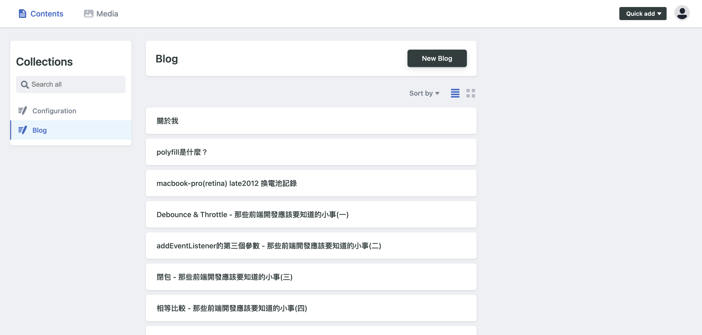
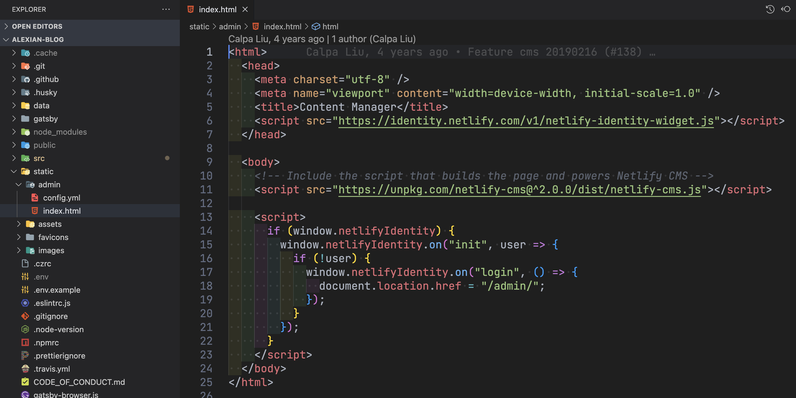
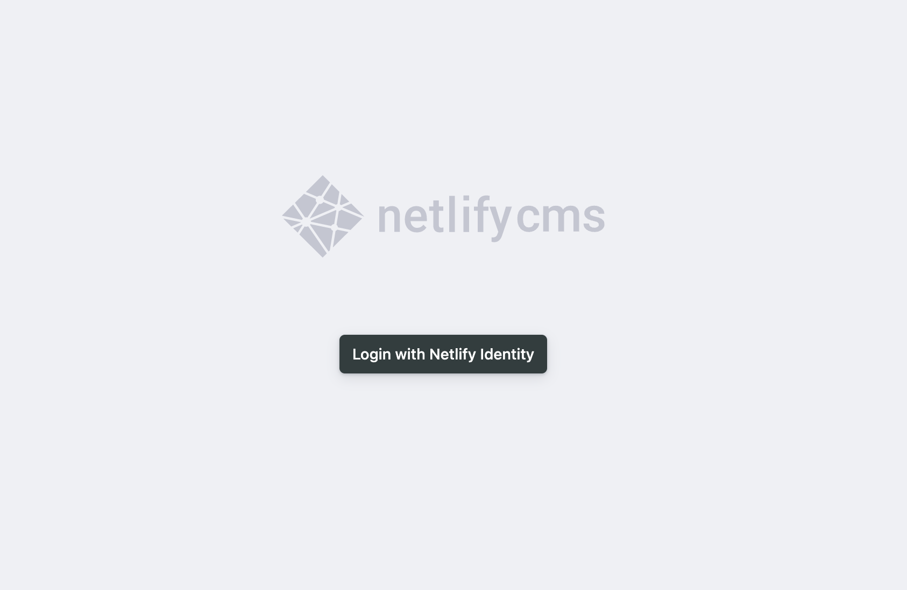
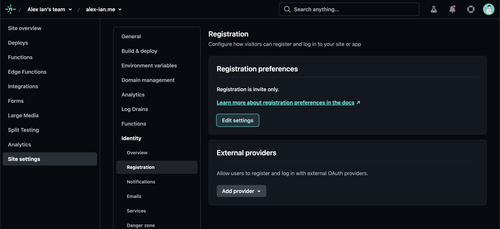
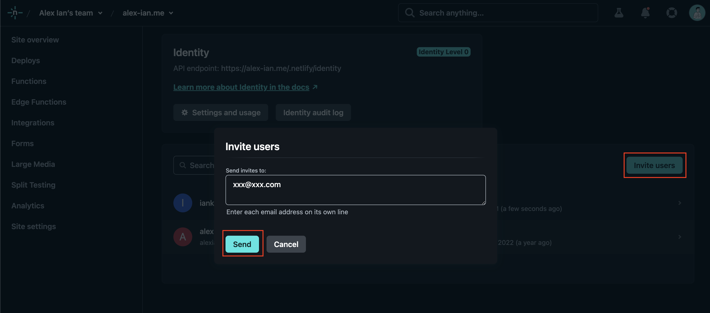
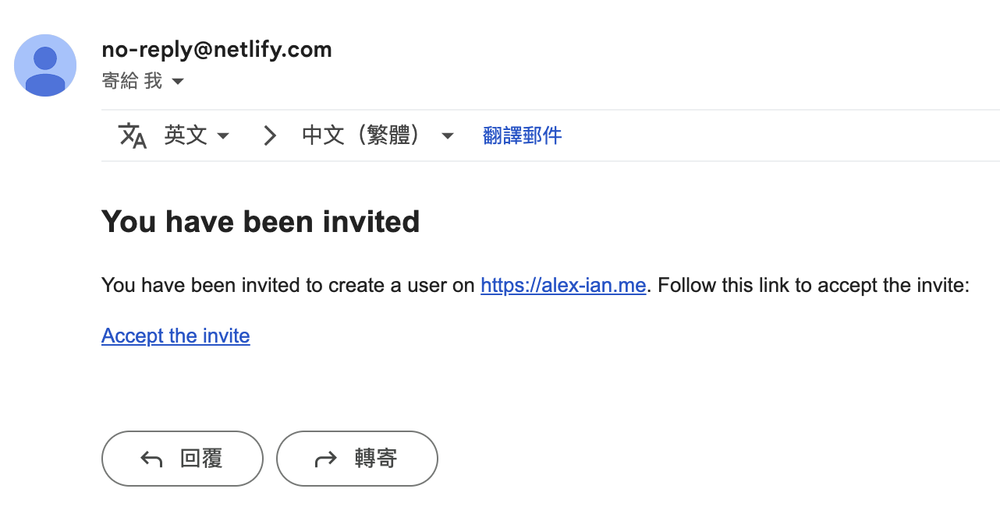
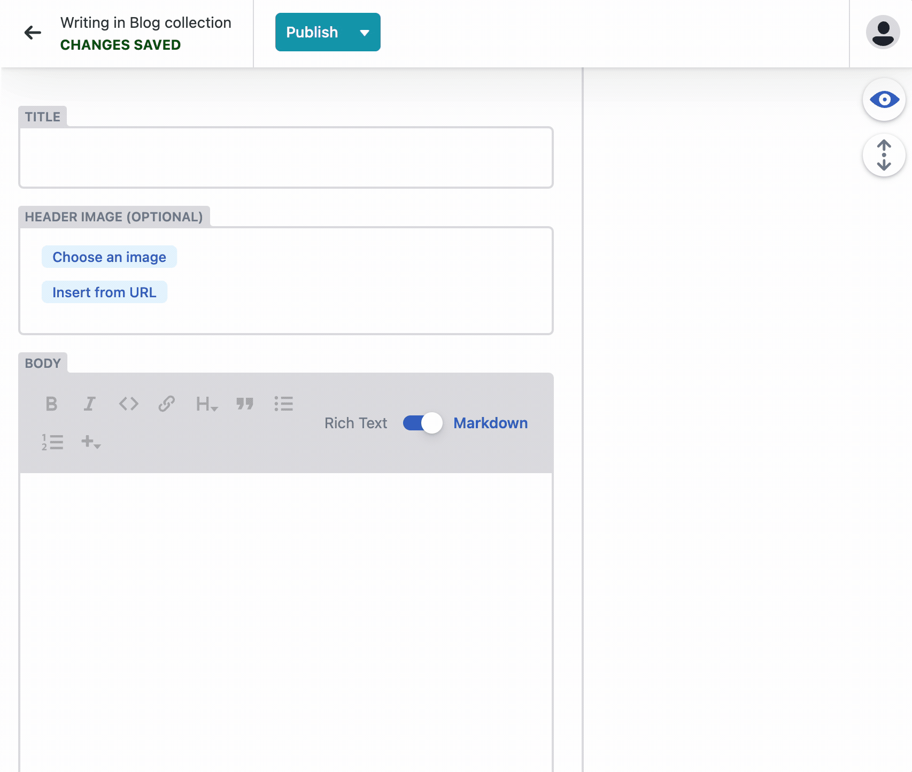

# 什麼是 Headless CMS？以探索 Netlify CMS 為例

小弟的部落格使用 Gatsby.js 框架來架設，作為一個靜態網站生成器（Static Site Generator，簡稱 SSG），主要聚焦於網站前台的設計，以及有助於提升 SEO；而相對地，後台操作介面則不是那麼重要，文章的格式使用 markdown，換言之我可以透過各種文字編輯軟體，諸如 Notion、hackMD 甚至 VScode 做內容建置，最後使用 git commit 推送來觸發 CI/CD 完成在 Netlify 的部署和更新。雖然聽起來簡單暴力，但如果只想稍微調整文案內容（例如改個錯字）；或是在文章更換圖片，雖然先複製圖片路徑，再從 markdown 貼上，步驟就稍嫌繁瑣了。為了解決這些繁瑣的問題，Netlify 提供了 Netlify CMS 這種 Headless CMS 的解決方法。

## 什麼是 Headless CMS？

Headless CMS （Headless Content Management System）是指只提供後台進行內容編輯的系統和介面，而其生成內容以會結構化的方式儲存（檔案 or 資料庫）。Headless CMS 的好處是可以讓使用者只需要專注於內容的產出，而呈現內容則可以使用 API 存取，讓呈現媒介隨開發者自行選擇，例如 App 或網頁。像個人部落格這種呈現內容為主的網站，就十分適合使用。

## Netlify CMS 介紹

[Netlify CMS](https://docs-starters--netlify-cms-www.netlify.app/) 是一款基於 Git 和 JavaScript 技術的開源內容管理系統，專為與靜態網站生成器（如 Jekyll、Hugo、Gatsby 等）而生，可以快速且簡單地創建、編輯和發佈內容。

Netlify CMS 提供了一個易於使用的 Web 界面，讓用戶可以直接在瀏覽器中編輯和管理內容，而無需進入 Git 存儲庫進行編輯。它還支持多種編輯器和編輯方式，例如 Markdown 編輯器、WYSIWYG 編輯器和自定義編輯器。另外，Netlify CMS 還提供了一個強大的權限管理系統，讓使用者可以輕鬆地設置不同用戶角色的權限和訪問權限。



## Netlify CMS 安裝方式

### 基本檔案配置

對於 Gatsby 的專案，Netlify-CMS 文件提供了 [手把手的安裝方式](https://www.notion.so/Headless-CMS-Netlify-CMS-fcce433759d94dfd9284668ffefc80e7)，只需要把文件中的範例 index.html 放入 /static/admin 目錄中即可：



但假如你要複用前台的內容，例如 scss 的樣式，建議可以使用 Gatsby 提供的 plugin [gatsby-plugin-netlify-cms/](https://www.gatsbyjs.com/plugins/gatsby-plugin-netlify-cms/)

```jsx
yarn add netlify-cms-app gatsby-plugin-netlify-cms
```

除了 index.html，還需要配置設定檔 `config.yml` 到 /static/admin 目錄，這邊先給一個基本範例，下面會再詳細說明

```yaml
backend:
  name: git-gateway

publish_mode: editorial_workflow
media_folder: static/assets
public_folder: ../../static/assets

collections:
	- name: "Configuration"
    label: "Configuration"
    files:
      - label: "Site Configuration"
        name: "site"
        file: "data/template/configs.json"
        fields:
          - { label: "name", name: "name", widget: "string" }
          - { label: "title", name: "title", widget: "string" }
	- name: "blog"
    label: "Blog"
    folder: "src/blogs"
    create: true
		fields:
      - { label: "Title", name: "title", widget: "string" }
			- { label: "Body", name: "body", widget: "markdown" }
```

一般來說安裝完成後，需要在推上 remote 讓 Netlify 部署後才能進行管理，但假如想要在本地端使用 Netlify CMS 的功能，可以使用 `netlify-cms-proxy-server` 實現，詳細可以看 [在本地使用 Netlify CMS | 鰭狀漏斗](https://vrabe.tw/blog/use-netlify-cms-in-local-machine#%E8%A8%AD%E5%AE%9A%E6%B5%81%E7%A8%8B) 的教學。

假設部署成功，便可以在 `https://你的網站/admin` 看到 netlify-cms 的登入畫面：



這邊是帳號管理是由 Nelify 處理，因為我們沒有尚未註冊過，可以到 Nelify 後台使用邀請註冊：

1. 前往 Nelify 後台，到你的網站管理 > **Site Settings** > **Identify** > **Registration**，點擊 **Edit Setting** 按鈕，在 **Invite only** 選項說明找到 Identity tab 連結並前往
    
    
    
2. 在 **Identity** 頁面中，點擊 **Invite user，** 在彈窗中輸入電郵並發送註冊邀請
    
    
    
3. 在信箱找到註冊邀請信，點擊 **Accept the invite** 前往填寫密碼，之後便可以在 netlify-cms 後台登入並管理內容。
    
    
    

### 設定資料架構與檔案目錄

假設前面的流程完成（或是使用本地端方式），應該可以看到一個乾淨的後台介面，點擊 New Blog，便可以像平常看到的部落格後台一樣建立新內容；或是在 media 頁籤，上傳圖片或文件等靜態檔案。而管理可以新增的內容，以及檔案的存放目錄，可以從前面提到的 `config.yml` 進行管理：

```yaml
backend:
  name: git-gateway # 使用 git 流程進行資料存取
  branch: master # CURD 的內容使用哪個 branch 管理

# 這邊是本地開發使用的配置，部署時會自動忽略
local_backend: 
  url: http://localhost:8000/api/v1

# 一般來說內容更新直接 commit，使用 editorial_workflow 可以改用 PR 方式對內容進行暫存
publish_mode: editorial_workflow
# 在後台預覽時的檔案目錄，media 也使用此目錄存取
media_folder: static/assets
# 在前台瀏覽時的檔案目錄，當使用 collection 內容時
public_folder: ../../static/assets2

# collections 用於設計有哪些欄位資料可供輸入，類別 DB scheme 的概念
collections:
  - name: "Configuration" # 集合名稱，不可與其他集合重複
    label: "Configuration" # 集合標示，顯示於 Contents 側邊欄的名稱
    files: # 內容以單檔案儲存
      - label: "Site Configuration" # 主要區塊標示名稱
        name: "site"
        file: "data/template/config.json" # 儲存檔案目錄與名稱
        fields: # 內容的欄位，下面再詳述
          - { label: "name", name: "name", widget: "string" }
          - { label: "title", name: "title", widget: "string" }
  - name: "blog"
    label: "Blog"
    folder: "src/test"
    create: true
    fields:
      - { label: "Title", name: "title", widget: "string" }
			- { label: "Header Image", name: "headerImage", widget: "image", required: false }
      - { label: "Body", name: "body", widget: "markdown" }

```

配置檔中，collections 集合提供相當大的彈性，使用可以使用單個配置檔更新資料（上述的 `Configuration`），也可以使用資料夾儲存多個檔案作為資料表，假如使用資料夾會預設以 md 檔案格式儲存，非常適合以 markdown 儲存內容部落格。

而填寫欄位的功能上，Netlify-CMS 提供了眾多方便 widget，除了基本的 boolean、 string 基本型別外，也有 markdown、image 等進階 widget 提升建置內容的 UX：



### 透過 git flow 儲存內容

前面提及了使用 `publish_mode: editorial_workflow` 作為更新內容的流程，所以在新增內容時，Netlify 會先建立新的 branch 和 Pull Request 作為草稿儲存，直到點擊 Publish，才會把 PR merge 到 branch 內，更新內容。

更新的內容，便可以使用 Gatsby 的 `gatsby-source-filesystem` 取用內容並生成新的部落格頁面，或是串接別的平台進行內容更新。

## 後記

Netlify CMS 還有更多進階的設定，例如預覽區塊的樣式、自訂 widget、field 的格式檢查等，因避免篇幅過長，這邊僅僅提及；有興趣的話讀者可以再深入研究。

透過 Netlify CMS 這種 headless CMS 進行內容建置，可以對內容建置提供簡易方便的操作介面，降低了建置網站後台的成本；同時透過 headless CMS 儲存的內容也因為通用的 markdown 或 json 格式而易於轉移，不會被綁定在特定的平台上。對內容建置者實在是一大發明。

### 參考資料

- [https://www.contentful.com/headless-cms/](https://www.contentful.com/headless-cms/)
- [https://vrabe.tw/blog/use-netlify-cms-in-local-machine](https://vrabe.tw/blog/use-netlify-cms-in-local-machine#%E5%85%B6%E4%BB%96%E8%AE%8A%E5%8C%96)
- ChatGPT