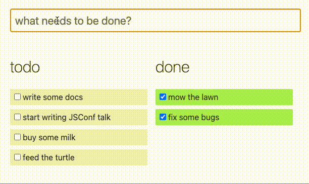

之前曾在 [Gatsby 部落格更新記錄 1.0](https://alex-ian.me/2022-11-27-blog-update-log) 提及了 Gatsby.js 可以使用 `gatsby-transformer-remark` 和 `gatsby-remark-images` 套件實現延遲載入圖片功能，可以該 png 和 jpg 等靜態圖片，在 markdown 檔案中使用相對路徑引用圖片達成延遲載入的功能，但對於 gif 這種非靜態圖片檔案則無法使用：

```markdown
<!-- 可以用 -->


<!-- 不能用 -->

```

要解決這個問題，可以使用 Gatsby.js 提供的 `gatsby-remark-copy-linked-files` 套件，該套件可以在建立網頁時，另存 markdown 內引用的檔案複製到打包內容中，所以其實不只 gif 圖檔，連 pdf 等檔案類型，都可以使用這個套件處理。

## 使用方法

1. 安裝 `yarn add gatsby-remark-copy-linked-files` 
2. 加入 config
    
    ```jsx
    {
          resolve: 'gatsby-transformer-remark',
          options: {
            plugins: [
    	        // 需要在 `gatsby-transformer-remark` 內加入
              {
                resolve: 'gatsby-remark-copy-linked-files',
                options: {
                  ignoreFileExtensions: ['png', 'jpg', 'jpeg', 'bmp', 'tiff'],
                },
              },
              {
                resolve: 'gatsby-remark-images',
                options: {
                  maxWidth: 1000,
                  wrapperStyle: () => 'width: 100%',
                  srcSetBreakpoints: [350, 750, 1000],
                },
              },
            ],
          },
        },
    ```
    

## 後記

要特別處理這件事，原因是我本身使用 Netlify CMS 進行文章的建置和編輯，當使用 image widget 加入圖片時，只能有一個 public_folder 路徑，如果我只使用 `/assets` 絕對路徑，png 和 jpg 便無法套用到 `gatsby-remark-images` 實現縮圖延後加載效果；但若我使用 `../../static/assets` 相對路徑，gif 又會無法取得，所以才需要此一調整。

```yaml
# static/admin/config.yml

# ...
media_folder: static/assets
public_folder: ../../static/assets
```