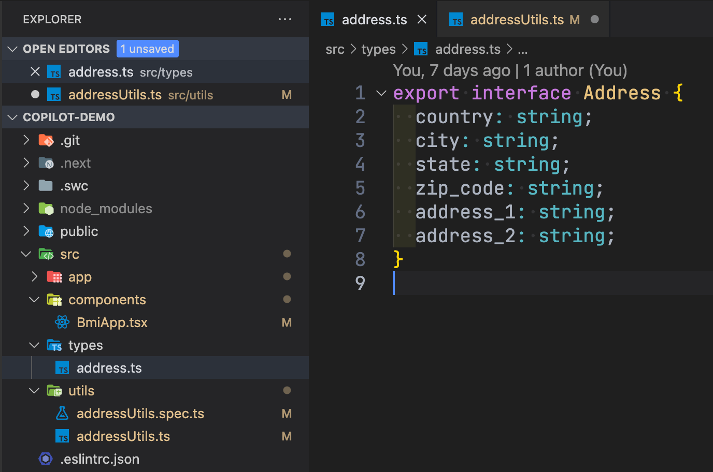
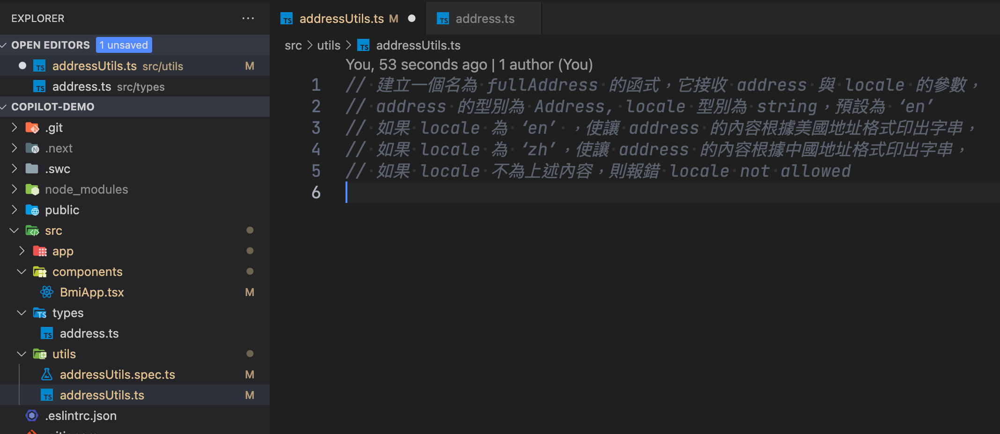
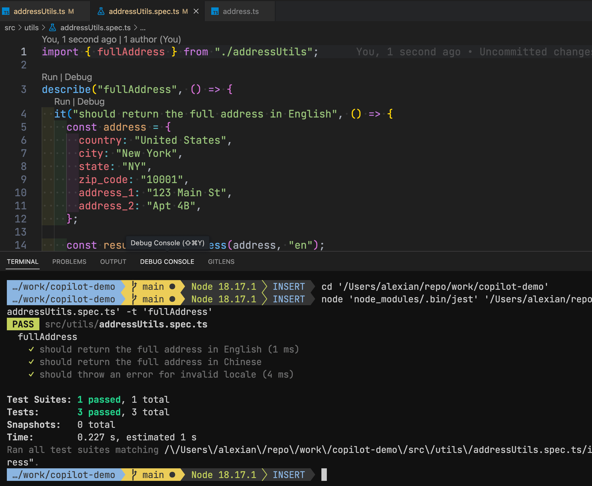
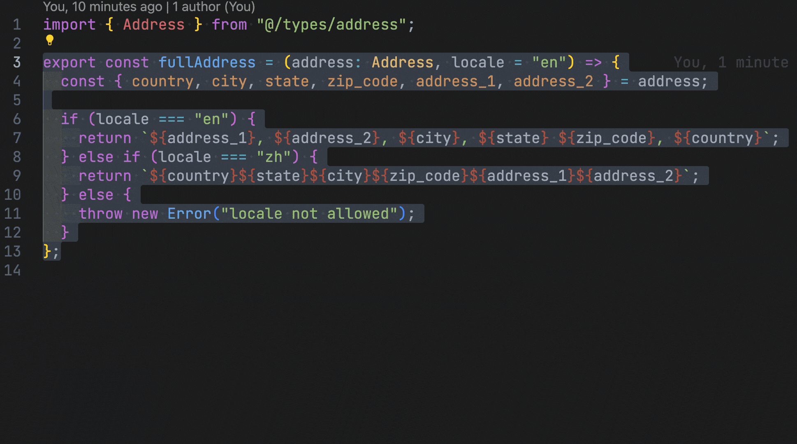

> 後悔自己為何沒有早點課金

在 [Modern Web Conference 2023 觀後感](https://alex-ian.me/mwc-2023) 提到在程式開發領域上，GitHub Copilot 會是非常有幫助的 AI 工具，因此我使用了魔法小卡刷下去，實際試用它的威力；在經過一個月（為什麼會記得？因為試用結束被扣款了嘻）的使用後，以下是我對 GitHub Copilot 的一些使用感受與心得。

# 使用的環境因素

雖然 Github Copilot 適用於 VSCode, JetBrains, NeoVim（Vim），但由於 GitHub 和 OpenAI 背後的金主爸爸都是 Microsoft，因此 Github Copilot 對於 Microsoft 的生態系整合是更為出色的，假如你是使用 VSCode / Visual Studio 進行開發，應該能夠得到更佳的開發體驗。

首先你要先到 <https://github.com/features/copilot> 課個金。

然後作為一個前端工程師，使用 VSCode 開發是很正常的，使用前要先安裝 Entensions：

* **[GitHub Copilot](https://marketplace.visualstudio.com/items?itemName=GitHub.copilot)**：會根據 IDE 的上下文進行生成
* **[GitHub Copilot Chat](https://marketplace.visualstudio.com/items?itemName=GitHub.copilot-chat)**：可以使用 chat 介面進行溝通，以及一些快速指令。

（根據強者我同事的說法，截至寫文時，目前 JetBrains 目前還沒有 Chat 介面可以使用）


# GitHub Copilot 的應用方式

一開始使用時，感覺和 VSCode 原有的一些 autocomplete 效果很像，在我輸入一些起始內容後，GitHub Copilot 會把我腦中想像的內容化為提示。只要簡單使用 tab 鍵便可以接受建議內容。但有時候 GitHub Copilot 首次生成的內容並不是我想要的，我需要一直重試才能得到我想要的結果，稍微有些廢時失事；為了最大化~~我的 10 美金~~我的工作效率，我參考了官方文件以及自我練習，習得了一些使用的技巧。

### 1. 使用 Ctrl + Enter 一次生成多個建議內容

一開始使用 GitHub Copilot，幾乎都是在輸入起始內容後稍作暫停，等待 GitHub Copilot 產出建議內容，又因為 GitHub Copilot 使用 GPT 3.5 turbo 與網速的限制，導致建議內容常常會以逐行的方式產生，或者產生出不如你預期的內容時，需要重新生成，這在長時間的使用下，會產生很大的延宕；


實際上 GitHub Copilot 有提供一次生成多個建議的內容的快捷鍵：在第一個提示出現後，鍵入 Ctrl + Enter，GitHub Copilot 會一次產出最多 10 個完整的內的建議內容，除了生成更快速，也可以因應你的需求選擇最適合的建議內容：


## 2. 使用註解和頁籤進行提示

ChatGPT 作為大型語別模型（LLM），除了可以透過你當下給予的提示進行回應外，也會依據之前每次的對答內容作為上下文（context），產出更準確和脈絡化的回答。而 Github Copilot 底層技術 實際上也是 LLM，因此可以和 ChatGPT 一樣，透過提供適合的上下文，讓 Github Copilot 回應更準確、更符合預期的建議內容，只是提供上下文的方式有些不同；Github Copilot 會掃描你當前開啟的整個檔案，包含已輸入的程式碼、註解文字；除了當前開啟的檔案外，也會使用已開啟的其它頁籤進行提示，下面我會進行一個示例證明。

### 示例：建立產出完整地址字串的函式

我已建立好一個 Address 的型別在目錄，我想根澽該型別建立一個產出完整地址字串的函式。



第一次開發時，先把 src/types/address.ts 檔案關閉，並在要建立函式的檔案起始處，加入了以下註解作為提示：

```typescript
// 建立一個名為 fullAddress 的函式，它接收 address 與 locale 的參數，
// address 的型別為 Address；locale 型別為 string，預設為 ‘en’
// 如果 locale 為 ‘en’ ，使讓 address 的內容根據美國地址格式印出字串，
// 如果 locale 為 ‘zh’，使讓 address 的內容根據中國地址格式印出字串，
// 如果 locale 不為上述內容，則報錯 locale not allowed
```

GitHub Copilot 會產出以下函式，看起來有根據我的提示，產出建議的函式：首先，他有根據 locale 判斷產出不同的結果，假如是 ’en’ 或 ‘zh’，會輸出不同的地址格式，而遇上 ’en’ 和 ‘zh’ 以外的結果，也有拋出錯誤；但有一個最大的問題，它使用的地址格式，和我預期的 Address 型別不相符：

```typescript
const fullAddress = (address: Address, locale: string = 'en'): string => {
  if (locale === 'en') {
    return `${address.street}, ${address.city}, ${address.country}`;
  }
  if (locale === 'zh') {
    return `${address.country}${address.city}${address.street}`;
  }
  throw new Error('locale not allowed');
}
```

- - -

第二次嘗試，我們把 address.ts 開啟在另一個頁籤上，再一次請 Github Copilot 輸出建議：



可以看到函式中使用的 address 參數雖然未有給定 Address 型別，但其實際使用的內容，與我們先前定義的型別完全相同。由此可以看出其他開啟的頁籤內容，也會作為 GitHub Copilot 產出建議內容的上下文使用。

```typescript
const fullAddress = (address, locale = 'en') => {
    let country, city, state, zip_code, address_1, address_2;
    if (locale === 'en') {
        country = address.country;
        city = address.city;
        state = address.state;
        zip_code = address.zip_code;
        address_1 = address.address_1;
        address_2 = address.address_2;
        return `${address_1}, ${address_2}, ${city}, ${state} ${zip_code}, ${country}`;
    }
    else if (locale === 'zh') {
        country = address.country;
        city = address.city;
        state = address.state;
        zip_code = address.zip_code;
        address_1 = address.address_1;
        address_2 = address.address_2;
        return `${country}${state}${city}${zip_code}${address_1}${address_2}`;
    }
    else {
        throw new Error('locale not allowed');
    }
}
```

## 3. 使用 GitHub Copilot 產出單元測試

產出函式後，要確保函式運行正常，我們通常會新增測試來驗證，單元測試是最常見的測試方式；現在 GitHub Copilot 可以幫助你快速建立好單元測試，在選取你要測試的函式後，使用 `cmd + i` 快捷鍵顯示行內的 GitHub Copilot Chat，輸入 `/tests` 指令後按 Enter，GitHub Copilot 便會為函式生成一系列的單元測試：



## 4. 使用 GitHub Copilot Chat 解釋程式碼

GitHub Copilot 除了可以為你產出可執行的程式碼和測試外，還可以為現有的程式進行解釋。

使用 cursor 選擇你要解檡的函式後，使用 `cmd + i` 快捷鍵顯示行內的 GitHub Copilot Chat，輸入「`請為我解釋程式碼`」後按 Enter，GitHub Copilot Chat 便會根據程式碼的功能進行語意化的解釋。

使用這個方式，在接手一些舊有專案時，遇到遺留程式碼（Legacy Code）時，便可以快速理解現有功能，對維護或是重構都非常有幫助。



## 感想

可能在 GitHub Copilot 推出之初，就有不少人使用了；而像我這樣的後進者，只能懊悔沒有早點使用，它在我的開發以及測試上，都極大的提升了我的效率。可能也有不少開發者擔心自己的開發資料會有外洩的風險，這的確是需要擔心的問題。但假如願意接受此風險，對於你的開發體驗確實會有很大的幫助。

另外，也有人擔心 GitHub Copilot 會不會取代工程師。以我的角度看，目前它產出的內容也可能會有 Bug，因此使用它的人需要具有閱讀/審核程式碼的能力，因此我認為它更像是一個輔助工程師開發的工具。只要你持續學習，就不用擔心被取代。

### 參考資料

* [Getting started with GitHub Copilot](https://docs.github.com/en/copilot/using-github-copilot/getting-started-with-github-copilot)
* [langchain 起手式 / 段喬智 (George) 共筆筆記](https://hackmd.io/@ModernWeb/2023/%2F9TwDjXrlSYGPvNsRFrx8XA#langchain-%E8%B5%B7%E6%89%8B%E5%BC%8F--%E6%AE%B5%E5%96%AC%E6%99%BA-George)