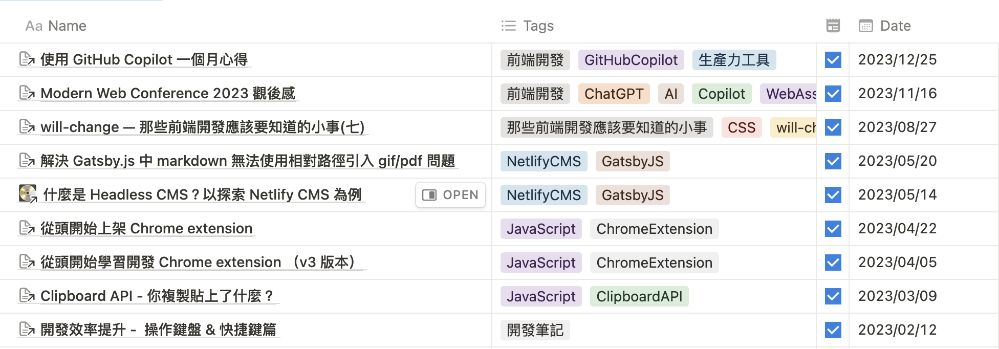
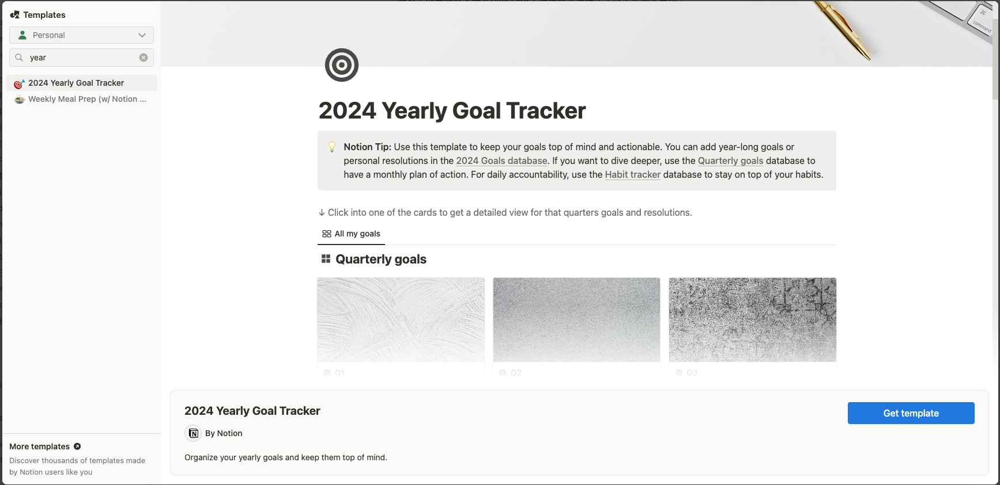
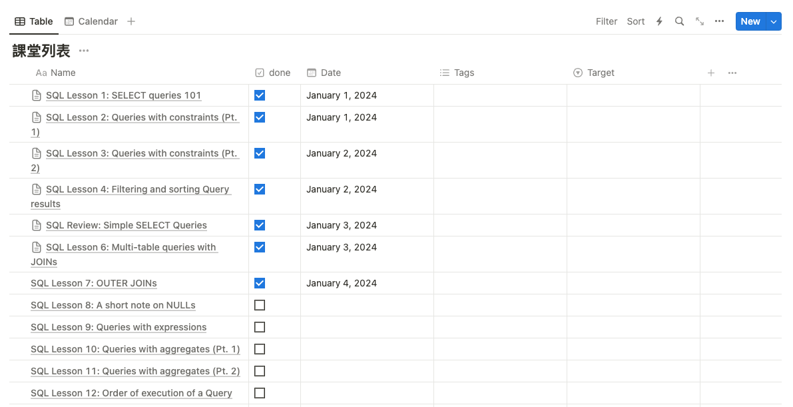
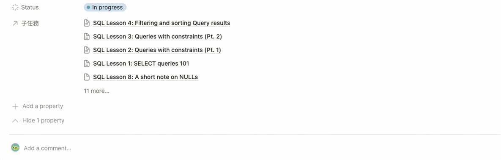
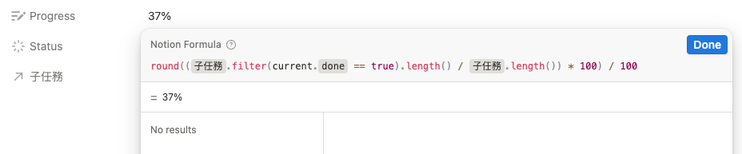
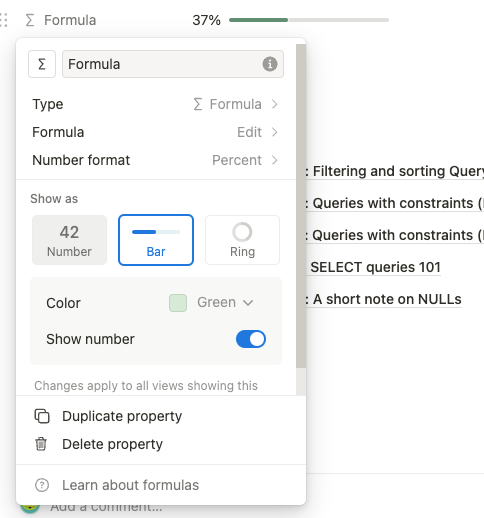

> 都進入 2024 才來展望

想要成為流量的奴隸，自然要成為一個跟風仔來做個年度回顧與展望。雖然是跟風，但年度回顧有它的作用：除了可以給自己一個機會正視自己的缺失，也能藉著回顧鼓勵自己，看看自己在一年中，究竟走了多遠、成長了多少。所以我也就來回顧一下囉。

# 去年度回顧

## 職涯發展

去年 4 月在公司任職滿 1 年，自認對於工作的環境和流程都算是相當上手，並在開發流程上產生良性影響，與同事的相處也相當融洽。然而在年初的職等提升評核，我並沒有通過，雖然推測和在職資歷有關，但仍然覺得有點可惜。希望去年的表現在今年的評核能派上用場吧～

## 自我提升

去年其實有自己訂定年度目標，其中包含認真的寫作部落格文章。原本希望每個月至少可以寫出兩篇文章，結果去年整年度僅有 9 篇文章，連每個月 1 篇都沒有達到；而且從文章的發佈日期來檢視，有三分之二的文章集中在上半年，且四月和五月有達到每月兩篇文章的標準，然而下半年的數據則慘不忍睹，充分表現出年度目標容易半途而廢的問題。



# 今年的目標與展望

關於職涯上的目標就交給公司的 OKR 了。以下是個人目標：

## 精進後端與 DevOps

雖然任職前端工程師，但經歷工作的洗禮，對於後端的工作內容有基礎的認識，在前公司更被當作全端在用的經驗。但在後端知識基礎不夠鞏固的情況下，很容易對自己的決定感到懷疑與不踏實，以及在回頭審視時，應該可以做出更好的決定。更遑論對 DevOps 的知識只有一鱗半爪，所以打算在今年內，對後端與 DevOps 的知識進行鞏固，不要求完全精通，但在瞭解原理與操作方式後，必定能在工作中發揮作用。目前打算學習大方向：

1. Database / SQL
2. 計算機概論
3. CI/CD

## 部落格文章更新頻率

在部落格透過去年數據的回顧，可以證明自己是有能力每個月至少可以寫出兩篇文章，所以今年自我部落格的目標會維持每月兩篇，並且以可視化的方式敦促自己。

# 使用 Notion 進行進度追蹤

為了有效的追蹤自己完成年度目標的進度，目前打算使用 Notion 的 Template；才發現 Notion 除了友善的寫作介面外，還有更多可能性，包含像是 database 的 Table 資訊，使用 relation 輸入函式 **Formula**（類似 excel 的公式）

這次我首先使用 Notion 的 **Yearly Goal Tracker** 模版來追蹤自己的進度。模板中提供了兩種目標的進度追蹤，包含以季度進行的大目標，以及以行事曆方式記錄的每天進度。由於我會使用 iPhone 的待辦事項來做每天事項，所以我只有使用它季度進行的大目標的內容。



在季度大目標以看板方式呈現，你可以新增自己的大目標，並且勾選要執行的季度；而我在看板的卡上加入了進度條，使用 **relation + formula** 的方式建立，以下以我學習 SQL 基礎內容做範例：

## 1. 建立 database，新增子任務

輸入 `/database` > 選擇 `Database - inline` 建立資料庫，新增的 done 欄位判斷子任務是否完成



## 2. 卡上使用 relation，建立 database 關聯

在卡上點擊 **add a property** > 選擇 **relation** 格式，再選擇剛刪建立的「課堂列表」進行 database 關聯，然後在 value 的區塊把所有子任務都選入關聯：



## 3. 使用 fomula 欄位，建立公式與進度條

在卡上點擊 **add a property** > 選擇 **formula** 格式，它提供了類似 Excel 的簡單運算函式。首先我們要計算出完成的百分比，所以是 `(完成的任務總數 / 所有任務總數) * 100%` ，為了好看，我們只保留整數，其公式以及呈現如下：

```tsx
round((prop("子任務").filter(current.prop("done") == true).length() / prop("子任務").length()) * 100) / 100
```



由於目前只有數字的呈現，要顯示進度條，我們需要調整該 Formula 的屬性，點擊欄位名稱 > 選擇 **Edit Property：**

1. **Number format** 設為 `Percent`
2. **Show as** 設為 `Bar`
3. **Show number** 設為 **on**

最後你就得到可視化的任務進度條了：



## 使用上的限制

使用這種方式建立的條度條，較適合在能明確列出工作項目/子任務的大目標，因為 relative 的關聯性需要手動加入，假如需要根據新增的項目來進行統計的資訊，可能需要使用付費版的功能 [database-automations](https://www.notion.so/help/database-automations) 才能實現。

# 總結

以往訂定年度目標時，都會在一開始幹勁十足，但到了下半年就會後勁不繼；為了給自己可持續執行的動力，使用可視化、可追蹤的進度表就顯得十分重要。這次試用看看 Notion 追蹤年度目標與進度的功能並分享大家，希望對於大家的年度目標有所幫助。

## 參考資料

* [banner - unsplash OC Gonzalez](https://unsplash.com/photos/silhouette-of-plant-during-sunset-xg8z_KhSorQ)
* <https://www.notion.so/help/formulas>
* <https://www.notion.so/help/relations-and-rollups>