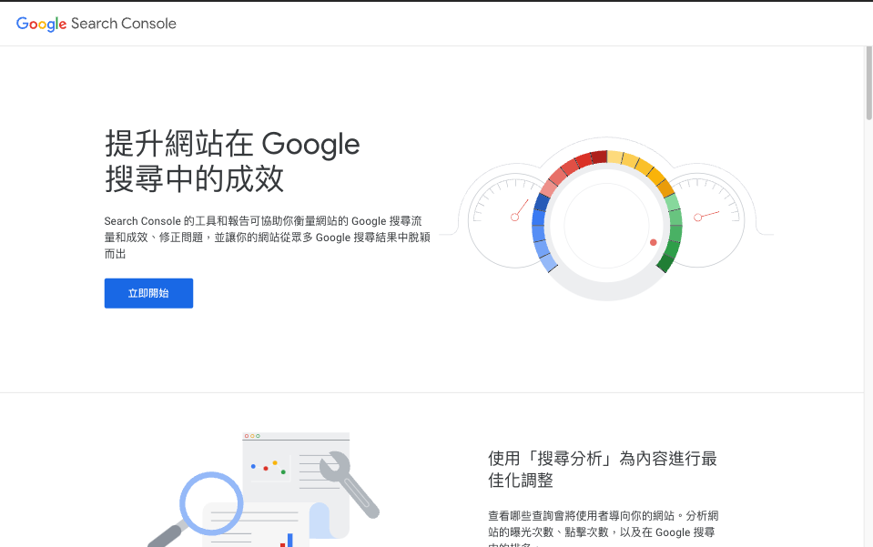
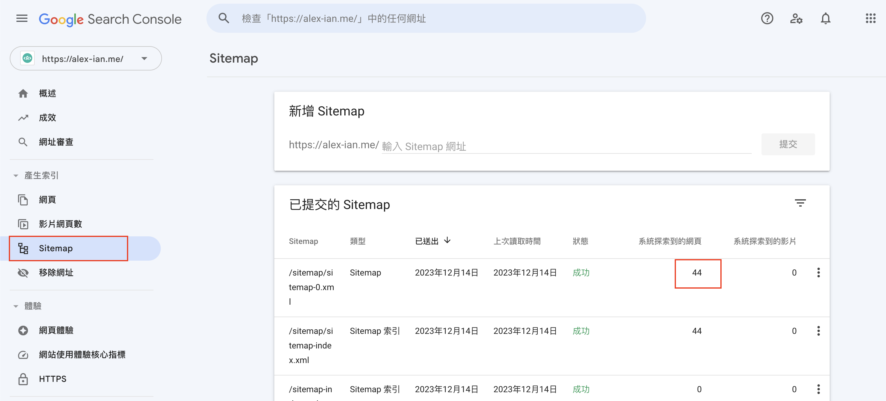
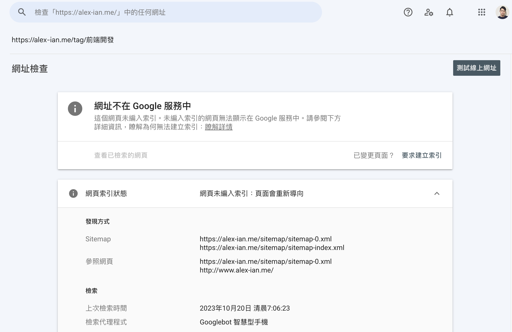
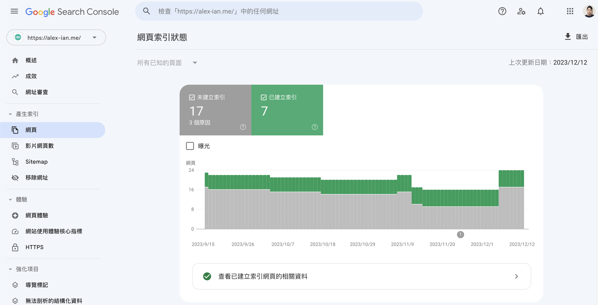
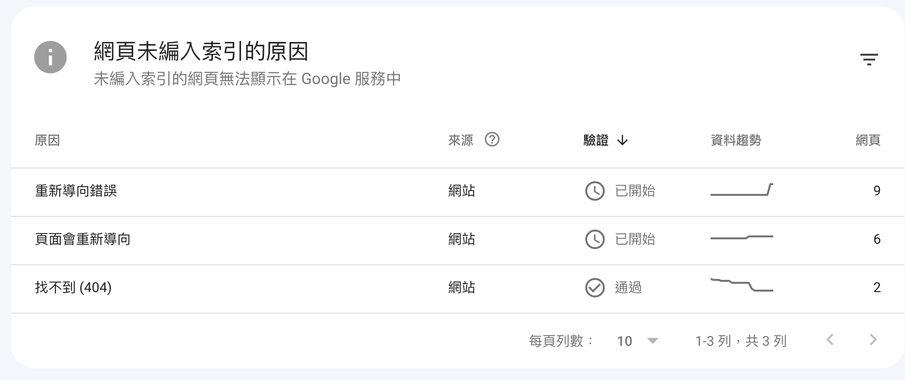
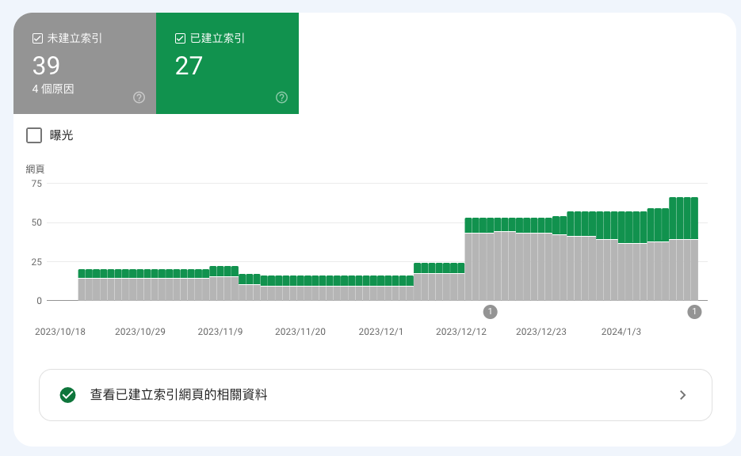

> 我的 SEO 也太爛

## 前言

之前一直忽略我個人部落格的流量，直到最近用瀏覽器的無痕模式試著用 Google 搜尋與我的新文章高度相關，而且相對指定的關鍵字，優先出現搜尋排名前列的結果，都是我在 Medium 平台發佈的頁面，而不是個人部落格的版本，部分個人部落格中的頁面沒有出現在任何搜尋結果當中；為了追根究底（成為流量的走狗），我用上了 [Google Search Console](https://search.google.com/search-console) 來排查（拯救）我的部落格文章在 Google 搜尋引擎中的狀況。

## **Google Search Console**

**[Google Search Console](https://search.google.com/search-console/about)** 是 Google 提供的免費服務，讓網站擁有者可以檢視自己網站中各頁面在 Google 搜尋引擎的表現、成效、是否有載入到 Google 搜尋引撆等資訊。



要使用 Google Search Console 的服務，首先要驗證你就是網域的擁有者，一般的方式是要你在網址下放置特定的 txt 檔進行驗證；若你的網域是使用 Godaddy 等代理商管理 DNS，更有類似 OAuth 的方式進行快速驗證。驗證成功後，可以進入檢視該網域下的資訊狀況。

## 使用 Sitemap 快速建立索引

Sitemap 是記錄你網站中各項網址或資源的文件，通常使用 XML 格式，透過在你的網站放置 Sitemap，並在 Google Search Console 介面中提交，Google 便會參考 Sitemap 中的內容去做爬蟲，以增加你的網頁被索引的機會。更詳細的 Sitemap 內容可以參考[這裡](https://developers.google.com/search/docs/crawling-indexing/sitemaps/build-sitemap?hl=zh-tw#sitemapformat)

一份範例的 Sitemap 檔案內容會長這樣：

```xml
<?xml version="1.0" encoding="UTF-8"?>
<urlset xmlns="http://www.sitemaps.org/schemas/sitemap/0.9">
  <url>
    <loc>https://www.example.com/foo.html</loc>
    <lastmod>2022-06-04</lastmod>
  </url>
	<url>
    <loc>https://www.example.com/bar</loc>
    <lastmod>2023-10-18</lastmod>
  </url>
</urlset>
```

在 Gatsby.js 中，可以透過 [gatsby-plugin-sitemap](https://www.npmjs.com/package/gatsby-plugin-sitemap) 這個 plugin 來自動生成 Sitemap：

* <https://alex-ian.me/sitemap-index.xml>
* <https://alex-ian.me/sitemap-0.xml>

在 Google Search Console 提交後，可以在「已提交的 Sitemap」列表中，看到系統從 Sitemap 探索到的頁面數量，但要注意如果 Sitemap 內容較多時，Google 可能需要更多時間去讀取，且 Google 也並不保證必定會對列出的內容進行爬蟲，為此我們也可以嘗試手動加入索引。



## 手動加入索引

假設你在部落格新增了一篇新文章，但 Google 未有即時抓取你的 Sitemap 進行更新，這時你可以嘗試手動建立索引。

在 Google Search Console 的導覽列搜尋欄中輸入你的新文章網址後，會顯示該網頁在 Google 搜索引擎的狀態，假如顯示「網址不在 Google 服務中」，你可以嘗試根據其列出的原因進行修正，在修正後可點擊「要求建立索引」，讓 Google 為網址排入索引的隊列。至於什麼時候正式執行，則是端看 Google 了。



## 檢視整體的索引狀態

在 Google Search Console 點擊側選單的 **產生索引 → 網頁**，可以看到你整個網站頁面的索引狀態，除了可以看到成效外，也更易於找出需要改善的問題。



例如我有不少頁面都未被成功索引，其原因在於重導向錯誤。後來發現是 Gatsby.js 舊有版本產出頁面路徑的 Bug，透過沒有結尾斜號（Trailing Slash）的路徑進入頁面後，會先重導向有結尾斜號的路徑，再回到結尾斜號的路徑，讓 Google 的網頁爬蟲認為這是惡意的重導向，而不讓頁面被索引。



解決方法參考了 <https://stackoverflow.com/questions/65826047/how-to-remove-trailing-slashes-in-gatsby-project> ，升級 Gatsby.js 版本後，使用 `trailingSlash: 'never'` 設定即可解決。設定後再重新索引，經過一個月的 Google 重新驗證後，網頁的索引恢復了不少。



## 使用 robots.txt 告知爬蟲入屋守則

除了以上項目，你還可以在網站主目錄建立 **robots.txt** 來告訴網頁爬蟲哪些頁面是可以爬取的，哪些則不可以，例如你可以在其中註記 Sitemap，以下是一個 **robots.txt** 的範例：

```
User-agent: *
Allow: /
Sitemap: https://alex-ian.me/sitemap-index.xml
Host: https://alex-ian.me
```

在 Gatsby.js 中，你可以使用 [gatsby-plugin-robots-txt](https://www.npmjs.com/package/gatsby-plugin-robots-txt) 來幫助你快速建立 **robots.txt**

```json
{
  resolve: 'gatsby-plugin-robots-txt',
  options: {
    host: url,
    sitemap: `${url}/sitemap/sitemap-index.xml`,
    policy: [{
      userAgent: '*',
      allow: '/',
    }],
  },
},
```

## 結語

以上是一些關於 Google Search Console 與提升網站能見度（甚至不能稱上 SEO）的一些基礎知識，以及我在 Gatsby.js 網站遇到的雷點記錄，對於相關的底層知識較少，藉著文章記錄實作方式，也希望可以幫助到使用 Gatsby.js 架設網站的朋友們，我們下次見～

### 參考資料

* banner from [Jake Hills](https://unsplash.com/photos/person-wearing-green-pants-bt-Sc22W-BE)
* [How to remove trailing slashes in gatsby project?](https://stackoverflow.com/questions/65826047/how-to-remove-trailing-slashes-in-gatsby-project)
* [建立並提交 Sitemap](https://developers.google.com/search/docs/crawling-indexing/sitemaps/build-sitemap?hl=zh-tw)
* [如何編寫及提交 robots.txt 檔案](https://developers.google.com/search/docs/crawling-indexing/robots/create-robots-txt?hl=zh-tw)