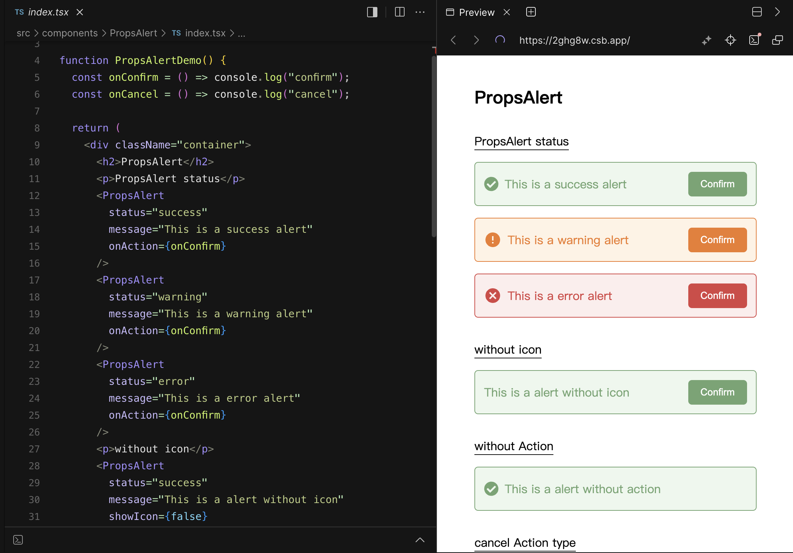
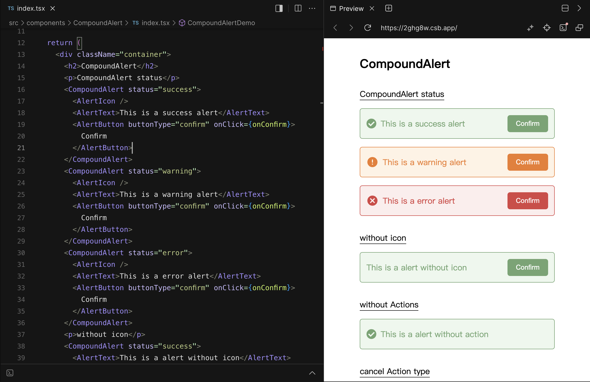

> 寫程式還要學化學嗎？

作為 React 的開發者，你或許有接觸過 Material UI ，Material UI 是一個 React UI 元件庫，有眾多的基礎元件可以使用，其中有些元件是透過多個 Component 組合而成，例如 [toggle button](https://mui.com/material-ui/react-toggle-button/) 透過使用 `ToggleButtonGroup` 與 `ToggleButton` 作組合實現切換效果，也可以透過在 `ToggleButtonGroup` 上加入屬性，改變整體的佈局。這種把單一元件切分為父元件與一個或多個子元件，並且共享部分屬性而實現應用功能的模式，就是 Compound Component （**複合元件**）設計模式。作為 React 基礎元件的設計模式（design pattern）當中一種有趣的設計模式。

# 原理與實作

要解釋其原理和實作方式，我們分別使用傳統的元件建構方式與複合元件設計模式來表達使用方式的範例，來做個直接的比較：

## 範例需求

這次的範例需求要建造簡單的 Alert 元件，以下是我的需求：

1. 使用顏色區塊顯示提示文字內容
2. 有三種不同的狀態（status）：`"success" | "error" | "warning”` 對應不同的樣式
3. 最左側可以放置選配的 Icon，根據不同狀態顯示不同 Icon。
4. 最右側可以放置選配的行動按鈕，且可選擇正面行為與負面行為兩種樣式；

## 傳統元件建造方式

在傳統 React 元件開發中，通常會通過 props 傳遞數據和配置，元件中依據 props 內容進行條件渲染， props 中包含函式、開關、顯示文案等的內容。以這個方式開發和使用的元件，這邊我統稱為傳統元件的模式。以下是我用傳統 props 模式建構的例子，使用上需要傳入各種 props，雖然只要引入一個元件，卻很難從 JSX 內容中，看出元件的佈局輪廓。

```tsx
import PropsAlert from "./PropsAlert";

<PropsAlert
  status="success"
  message="This is a success alert"
  onAction={onConfirm}
  actionType="confirm"
  actionText="Confirm"
/>
```



## **複合元件**建構方式

接下來我打算把元件拆分為以下架構：

* 主元件 Alert 只需接受 status props，剩下內容以 children 接受
* 子元件 AlertIcon
* 子元件 AlertText
* 子元件 AlertButton，接受 onClick 與 buttonType

使用 Compound Component 模式建構的使用方式如下，雖然單純看使用方式，會認為其結構較 Props 模式來得更複雜，但相對在 JSX 架構下，可以看出其佈局，提升了可讀性，不再需要猜測 actionText、onAction 和 actionType 在 Alert 元件中的使用方式。

```tsx
import CompoundAlert, {
  AlertButton,
  AlertIcon,
  AlertText,
} from "./CompoundAlert";

<CompoundAlert status="success">
  <AlertIcon />
  <AlertText>This is a success alert</AlertText>
  <AlertButton buttonType="confirm" onClick={onConfirm}>
    Confirm
  </AlertButton>
</CompoundAlert>
```



不知道你會不會好奇，我的 AlertIcon 明明沒有傳入 status 的參數，它是如何得知要根據 status 切換為不同的 Icon 呢？其實原理很簡單，就是在子層元件之間共享一組元件狀態。聽起來是不是很熟悉呢？在元件層加入區域狀態的 API ，沒錯，是 context，我加了 context。


透過 context API 在頂層元件建立 Provider，便可以在各子元件中取得預設或是自定義的設定內容，可以說複合元件的本質，就是局部性的 theme provider。

```tsx
const AlertContext = createContext<Omit<CompoundAlertProps, "children">>({
  status: "success",
});
const useAlertContext = () => useContext(AlertContext);

const CompoundAlert = (props: CompoundAlertProps) => {
  const { status, children } = props;

	// 父元件把 props 傳入 context 
  return (
    <AlertContext.Provider value={props}>
      <div className={`alert ${status}`}>{children}</div>
    </AlertContext.Provider>
  );
};

const AlertIcon = () => {
  // 子元件從 context 取得狀態
  const { status } = useAlertContext();

  switch (status) {
    case "success":
      return <FaCheckCircle size="20" />;
    case "warning":
      return <RiErrorWarningFill size="24" />;
    case "error":
      return <MdCancel size="24" />;
    default:
      return null;
  }
};
```

[範例 CodeSandbox](https://codesandbox.io/p/sandbox/compound-component-example-forked-2ghg8w?file=%2Fsrc%2Fcomponents%2FCompoundAlert%2Findex.tsx%3A1%2C1-62%2C1)

[範例 Repo](https://github.com/aforian/compound-component-demo)

# 使用 Compound Component **複合元件模式**的優缺點？

作為一個設計模式，總不可能在所以場景下都適用，必須在適合的場景下使用，才能發揮其優勢，以下是複合元件模式的一些優缺點：

## 優點一、提高可讀性

這React 使用 jsx 進行開發，其中一個優勢是提高 Layout 的可讀性，使用複合元件模式正好利用這一個特性，也在前述的範例也有表現出來，假如使用 props 方式傳入各部件，需要進入元件才能看出其佈局方式。

## 優點二、提高重用性與佈局彈性

使用元件化的方式開發，其中一個原因是有較佳的維護性與調整彈性，而使用複合元件模式開發，則可以提供更佳的佈局彈性。假設剛剛的 Alert 元件需要進行調整，例如可以根據使用情境把 Icon 放到最右邊、或是一次需要顯示多個行動按鈕，如果使用 props 模式建構的元件，就需要新增 props，也要注意會不會影響原本使用該元件的頁面，而複合元件底層幾乎無需調整，也就不用擔心影響現有使用的頁面

```tsx
<p>Icon at right</p>
<CompoundAlert status="success">
  <AlertText>This is a success alert</AlertText>
  <AlertIcon />
</CompoundAlert>

<p>Two buttons</p>
<CompoundAlert status="success">
  <AlertIcon />
  <AlertText>This is a success alert</AlertText>
  <div>
    <AlertButton buttonType="confirm" onClick={onConfirm}>
      Confirm
    </AlertButton>
    <AlertButton buttonType="cancel" onClick={onCancel}>
      Cancel
    </AlertButton>
  </div>
</CompoundAlert>
```

### 缺點、過度靈活性，需要使用教學

水能載舟，亦能覆舟。複合元件提供了非常高的使用彈性，但也由於複合元件並沒有強制範定子元件的排序與使用方式，因此入門開發者會對它的使用方式感到困惑，或是不瞭解其原理而傳入錯誤的 props 或資訊。因此建立複合元件後，最好搭配元件開發輔助工具例如 [Storybook](https://storybook.js.org/) ，以便於與 UI 或協同開發者訂定該元件使用或樣式的共識。

# 結論

複合組件（Compound Component）設計模式在 React 應用開發中提供了一種高效且靈活的組件組合方式。通過這種模式，開發者可以創建高度可重用和可定制的組件，同時保持代碼的清晰和易於維護。然而，正如任何設計模式一樣，適當地使用和管理複合組件對於避免潛在的缺點和挑戰至關重要。通过深入理解並恰當運用複合組件，開發者可以在 React 應用中實現更高效和靈活的組件組合策略。

### 參考資料

* Photo by [Mourizal Zativa](https://unsplash.com/@mourimoto?utm_content=creditCopyText&utm_medium=referral&utm_source=unsplash) on [Unsplash](https://unsplash.com/photos/blue-red-yellow-and-green-lego-blocks-gNMVpAPe3PE?utm_content=creditCopyText&utm_medium=referral&utm_source=unsplash)
* [MUI toggle button](https://mui.com/material-ui/react-toggle-button/)
* [範例 Repo](https://github.com/aforian/compound-component-demo)