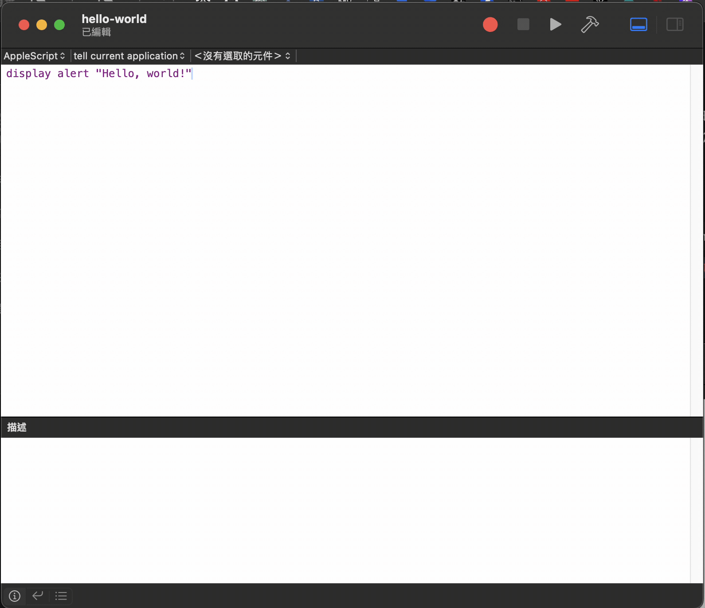
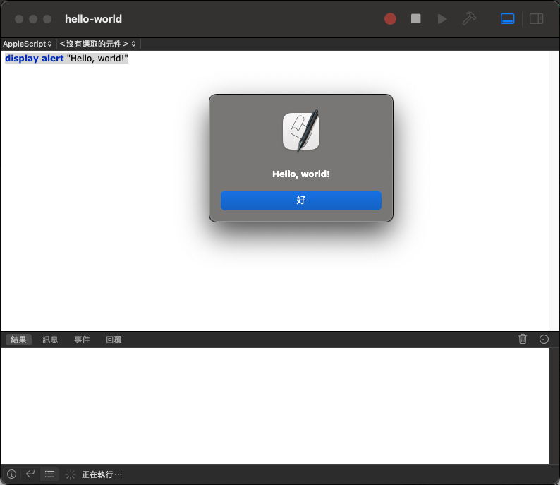
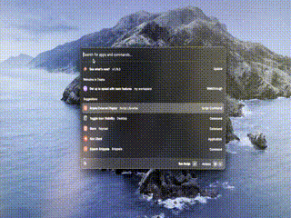
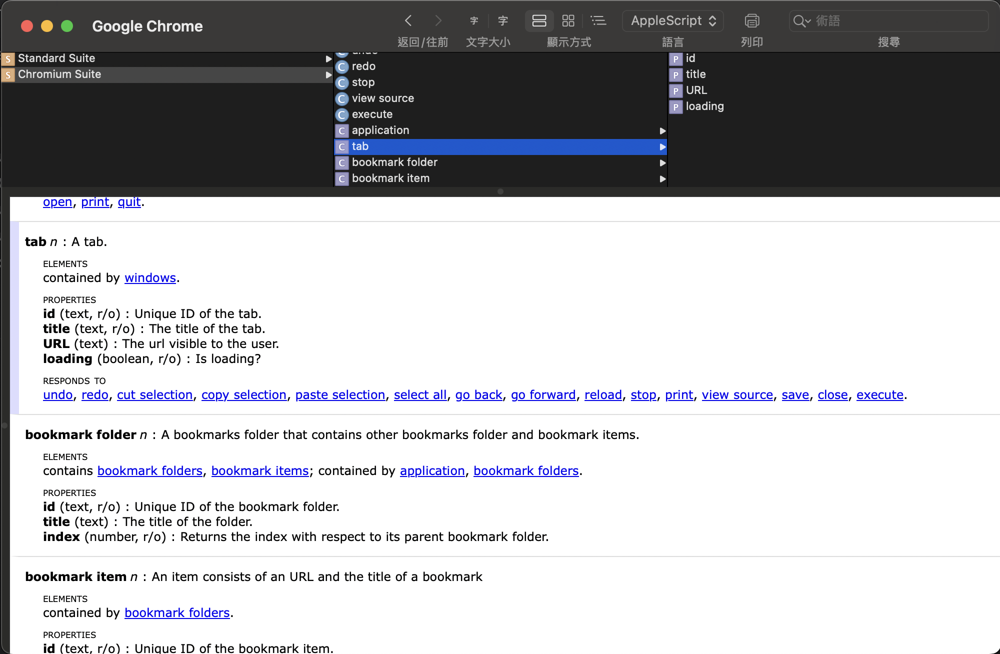
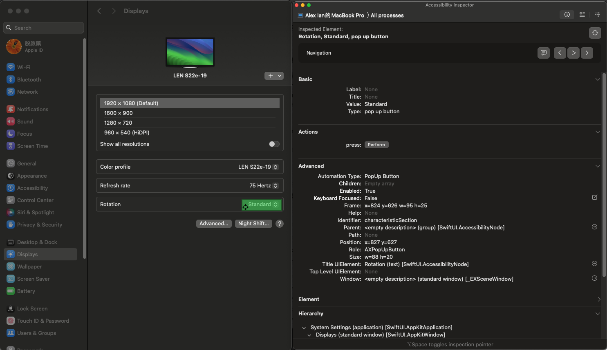
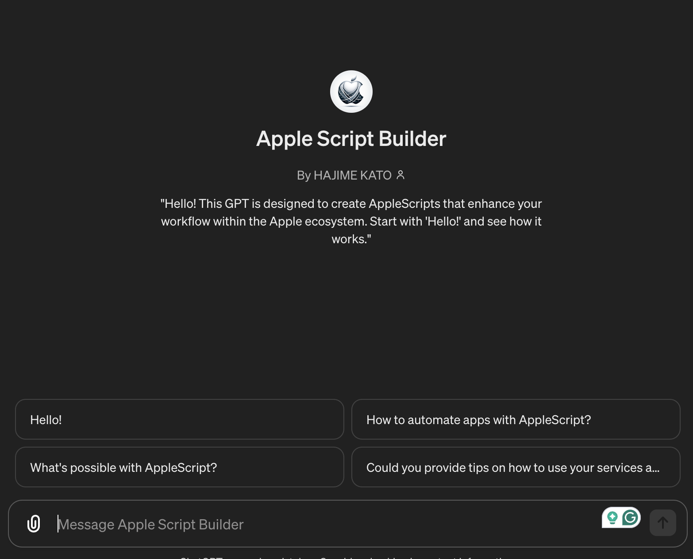

> 就是你知道的那個 Apple

我們在使用瀏覽器時，除了原瀏覽器提供的功能，也常常會使用 extension 對瀏覽器的功能進行擴充，而有前端開發經驗的使用者，更會透過 JavaScript 來為自用的瀏覽器開發自訂功能的 UserScript。但除了瀏覽器以外，你也可以在 macOS 上使用手稿語言實現自訂功能的 UserScript，而它所使用的手稿語言，便是 **AppleScript**。

# 什麼是 AppleScript？

AppleScript 是蘋果公司推出的手稿語言，用於控制 macOS 上的應用程式，以實現自動化流程作業，完成一些重複性較高、但技術含量較低的任務，比如：文件系統化命名、根據電子郵件內容自動回覆、自動生成報告等。它的語法相當平易近人，與日常的語言表達方式相差無異，假如有過一些高階程式語言的基礎（比如 JavaScript、Python），會十分容易上手。

以下會介紹 AppleScript 基本的開發方式，搭配一些我實際應用到的例子來做示範，讓大家感受其好用之處。（如果你看到這邊，我就假設你有點程式語言的底子了）

# AppleScript 的開發基礎

## 工序指令編寫程式（Script Editor）

工欲善其事，必先利其器，而準備開發 AppleScript 的環境相當輕鬆，只要你使用的是 macOS 系統，就可以使用 MacOS 預設「工序指令編寫程式」（Script Editor）進行開發，其介面雖然看起來稍嫌陽春，但對於基本的事件開發和執行，已經相當足夠了。

## Hello World 來學基本功能

開始學習一個新的程式語言，免不了要遵巡慣例，那我們就先來寫個 Hello World 吧！

在「工序指令編寫程式」檔案 > 新增，會顯示新視窗，輸入 **`display alert** "Hello, world!"` 。

一開始輸入時，內容會以紫色來表示這內容未經過編譯檢查，可以點擊右上方的錘子圖示「編譯工序指令」進行編譯，過程會檢查程式中的語法是否正確，假如出現錯誤也會即時顯示語法錯誤的原因，因此在除錯上非常有幫助；而假如內容都正確無誤可以正常運作，輸入的內容會出現語法突顯：



這時候再點擊右上的播放圖示「執行工序指令」，便會執行剛剛寫好的指令，跳出 `Hello, world!`。



是不是很簡單呢？

## 資料類型、條件判斷、迴圈

而作為一門手稿語言，基本的資料類型、條件判斷、迴圈等項目自然是必不可少，假如有一些程式底子，應該很快便能熟悉，因此這裡我們使用一系列的範例程式來快速帶過：

```bash
# 資料類型
set myInteger to 10   # integer
set myText to "alex"   # text
set myBoolean to true   # boolean
set myList to {"apple", "banana", "orange"}  # list，類似 js 的 array
set myRecord to {name:"alex", age:"18"}  # record，類似 js 的 object
on myHandler(arg)  # handler，類似 js 的 function
  log "my handler " & arg
end myHandler

log class of myInteger 
log class of myText
log class of myBoolean
log class of myList
log class of myRecord
log class of myHandler

# 條件判斷
set ans to display dialog "你今年幾歲？" default answer ""  # 跳出詢問彈窗

if (text returned of ans as number) < 18 then  # 判斷數值
	display alert "你這個乳臭未乾的小鬼"  # 假如符合，回應內容
else
	display alert "你已經是個大人了"  # 假如不符合，回應內容
end if

**# 迴圈 1 - 基本迭代
repeat with i from 1 to 5
    display dialog "這是第 " & i & " 次迭代"
end repeat

# 迴圈 2 - list 歷遍
set myApps to {"Safari", "Chrome", "Firefox"}

repeat with myApp in myApps
	log myApp
end repeat**
```

而透過以上的範例，應該可以隱約感受 AppleScript 的語法非常貼近人類用的語法，而較少使用符號來進行語法輸入，例如賦值變數的  `set ... to ...` 或是迭代的 `repeat with i from ... to ...` ，因此具有極佳的可讀性。

# 使用 AppleScript 操作應用程式

除了基本的程式流程外，AppleScript 最特別也最具影響力的功能，是可以在 macOS 中，讓應用程式隨你的想法進行流程化的操作。

## 範例 1 - 使用 AppleScript 實現複製 Chrome 當前頁籤

有些應用程式都會在右鍵藏有一些有用的功能，但卻因為沒有快捷鍵而導致使用不便，例如 Chrome 的複製頁籤功能，而使用 AppleScript 則可以重新實現這些功能，並透過 Raycast、Alfred 等桌面啟動器綁定指令到你自訂的快捷鍵上：

```bash
tell application "Google Chrome"
	tell front window # 告訴 Chrome 最前面的視窗
		set tabIndex to active tab index #  取得目前視窗的正在打開頁籤 索引
		set myURL to URL of active tab # 取得目前視窗的正在打開頁籤的 URL
		make new tab at after tab tabIndex with properties {URL:myURL} # 在當前頁籤的後方打開新頁籤，並輸入同一個 URL
	end tell
end tell
```

我透過 raycast 的 script command 加入快捷鍵後，便可以在 Chrome 上透過快捷鍵執行以上的行為，結果如下：


## 範例 2 - 使用步驟轉換外接螢幕方向

作為一個軟體工程師，工作區域通常會接上外接螢幕進行工作；而根據不同的使用場景來切換螢幕的方向，例如看影片/會議時，會使用橫式方向；在看文章/程式碼時，則會使用直式方向，有些廠牌的螢幕非常智慧，在透過螢幕支架物理轉換螢幕方向後，會如同行動裝置般，螢幕的運作會自動切換方向；但更多的是需要手動在 OS 的顯示器設定界面進行處理。因此就有了想要透過 AppleScript 自動化操作這一流程的做法：

```bash
tell application "System Events"
	
	key code 107 using {option down} # 透過原生的鍵盤快捷鍵開啟系統設定中「顯示器」視窗
	
	delay 1 # 等候 1 杪，讓「顯示器」視窗開出來
	
	tell window "Displays" of application process "System Settings"
		tell pop up button 0 of group 4 of scroll area 2 of group 0 of group 2 of splitter group 0 of group 0
			
			set currentRotation to value of it # 將按鈕的值存至變數 currentRotation
			
			click
			
			tell menu 1 # 對開啟的選單進行操作
				if currentRotation = "Standard" then # 假如目前螢幕方向為標準狀態（橫式）
					click menu item 4 -- 270° # 選擇選單的第 4 個選項，即 270°（直式）
				else
					click menu item 1 -- standard # 否則選擇選單的第 1 個選項，標準狀態（橫式）
				end if
			end tell
		end tell
		
		delay 1.5 # 等候 1.5 杪，讓操作完成
		
		if exists of sheet 1 then
			click button 2 of group 0 of sheet 1 # 點擊「保留」按鈕
			display notification "portrait mode" with title "Rotate Success" # 顯示通知
		else
			display notification "landscape mode" with title "Rotate Success" # 顯示通知
		end if
	end tell
end tell

delay 1

tell application "System Settings"
	quit # 關閉系統設定
end tell
```

同樣透過 raycast 執行：



# AppleScript 的實現方式

乍看之下，其語法操作方式與範例 1 的寫法有極大差異，是因為寫 AppleScript 進行流程操作有著兩種截然不同的實現方向，而它們有各自的優勢和適合使用的場景：

## 方向 1 - 使用各個應用程式提供的指令詞彙（Dictionary）進行開發

許多在 macOS 的應用程式，都會提供類似 API 的可用的指令詞彙（Dictionary），讓有技術背景的使用者可以使用 AppleScript 的方式對應用程式實現自定義的流程或自動化操作，其位置可以在 **工序指令編寫程式** 的選單列上 `檔案 > 打開指令詞彙…` 來檢視，例如在範例一中使用的語法 tab、active tab index 等，都可以在 Chrome 提供的指令詞彙找到其可用的方法。



由於指令詞彙是應用程式自行建構，使用它來開發自動化流程，就好比使用官方 API 進行串接，不需要加入任何等候操作的延時行為，因此在操作上會更為順暢，而在程式碼的可讀性上也更好。但也因為指令詞彙是應用程式自行提供的，甚至有些應用程式完全沒有提供可用的指令詞彙，導致無法實現想要完成的操作行為，這時候我們可以往方向 2 的方式進行。

## 方向 2 - 透過 System Events 和 Accessibility Inspector 進行開發

當你想要自定義的應用程式缺少可實現的指令詞彙，導致 AppleScript 開發難產時，先別灰心，就像瀏覽器可以使用 puppeteer 來進行網頁爬蟲；在 AppleScript 中，你也可以使用 System Events 和 Accessibility Inspector 來進行替代開發，其概念類似使用 Chrome devTools 的 console 和 element 頁籤；透過 Accessibility Inspector 找出你要操作的元素，然後使用 System Events 執行 keyboard 和 mouse event，以完成整個操作流程。例如範例 2 中的這行：

```bash
tell pop up button 0 of group 4 of scroll area 2 of group 0 of group 2 of splitter group 0 of group 0
```

就是使用 Accessibility Inspector 來選取該元素，以檢視其區塊的從屬路徑，而使用 Accessibility Inspector 時，建議使用英文的界面，會對元素名稱有較佳的體驗。



另外許多應用程式都有自訂的快捷鍵，這些快捷鍵也可以透過 System Events 的 `key code` 來觸發，藉此省去一些選取元素的步驟。

# 使用別人造好的輪子

作為 macOS 自定義流程式的重要部分，一定有不少人使用 AppleScript 實現過你想要做的功能，假如你受困於想寫的指令過於複雜，不妨透過開源的資源取得協助，例如以下我在進行 AppleScript 開發時用過的資源：

* Slack：https://github.com/samknight/slack_applescript
* 實用 AppleScript 大全：https://github.com/kevin-funderburg/AppleScripts

另外 AI 越來越普及，在 ChatGPT 中也有開發者建立了協助開發 AppleScript 的 GPTs [Apple Script Builder](https://chatgpt.com/g/g-BHSUPtL0P-apple-script-builder)，透過它的協助我開發了不少有趣的應用情境。



# 總結

內容由於篇幅有效，沒有辦法做更詳細的講述，但藉上述的範例和方向，希望能讓大家感受到使用 AppleScript 的魅力所在，進而透過 AppleScript 提升工作/生活效率喔～

## 參考資料

* [https://zh.wikipedia.org/zh-tw/AppleScript](<* https://zh.wikipedia.org/zh-tw/AppleScript>)
* [https://github.com/JXA-Cookbook/JXA-Cookbook/wiki](https://github.com/JXA-Cookbook/JXA-Cookbook/wiki/Using-JavaScript-for-Automation)
* [https://apple.stackexchange.com/questions/459256](https://apple.stackexchange.com/questions/459256/)