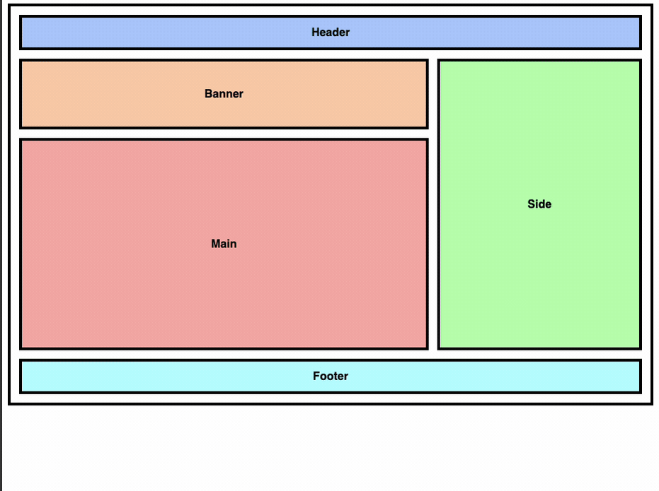
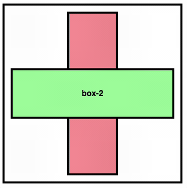
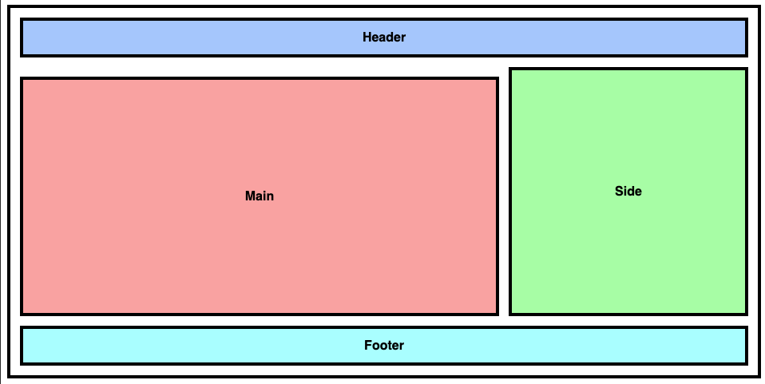
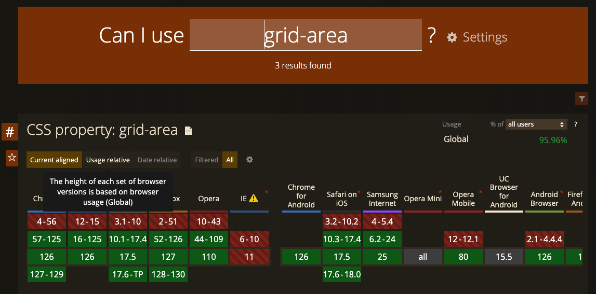
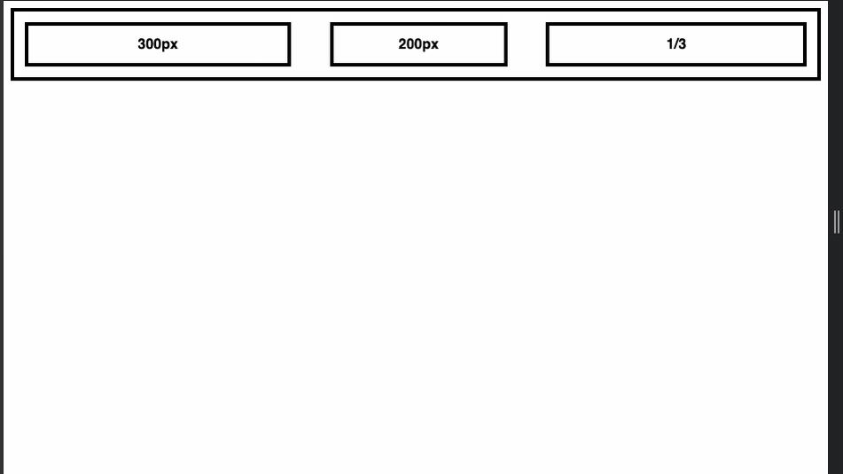

> 都 4202 年了，還有人不會用 CSS 的 grid 排版喔

話說小弟自從任職前端以後，除了短暫經歷接案為生外，其它的經歷都在電商相關的產業上，而電商產業在前端較重視的一環，便是要讓購物網站的前端相容性最大化；而在 Internet Explorer 尚未斷氣的 2022 年以前，在工作上的切版任務完全沒有機會使用除了 flex 以外的佈局方式。直到最近一個新專案上，我們終於決定要放棄對 IE 11 相容，因為可以用上實用性較好的 grid 佈局，這也是我第一次認真學習 grid 的契機。如果想學習 grid 佈局，除了可以直接從 MDN 學習，也有不少線上資源可以參考；以下是一個長期幾乎只使用 flex 佈局的前端仔對 grid 略知皮毛後，記錄一下學習 grid 的心得。

## grid 佈局基礎概念

### 表格般的佈局

開始學習 grid 的第一個感受是，在上古世紀使用 Dreamwaver 開發網頁的設計師、或是要實作 email 內容的開發者，必定能夠快速理解對 grid 佈局的概念，因為 grid 的本質就是用表格的方式去實現佈局，而表格的特性是格子的行列數量固定，而每行/列的尺寸也會相同，因此非常適合畫面內容固定，而在排序上差異較大的頁面。例如頁面區塊的佈局：

<iframe height="400" style="width: 100%;" scrolling="no" title="Grid-demo-1" src="https://codepen.io/alexian/embed/OJYwxYr?default-tab=" frameborder="no" loading="lazy" allowtransparency="true" allowfullscreen="true"
  See the Pen <a href="https://codepen.io/alexian/pen/OJYwxYr">
  Grid-demo-1</a> by alex ian (<a href="https://codepen.io/alexian">@alexian</a>)
  on <a href="https://codepen.io">CodePen</a>.
</iframe>

~~夢迴 Dreamwaver~~，在不考慮 RWD 的情況下，用 Table 實現出一樣的效果：

<iframe height="400" style="width: 100%;" scrolling="no" title="Table-demo-1" src="https://codepen.io/alexian/embed/VwOBVEq?default-tab=" frameborder="no" loading="lazy" allowtransparency="true" allowfullscreen="true">
  See the Pen <a href="https://codepen.io/alexian/pen/VwOBVEq">
  Table-demo-1</a> by alex ian (<a href="https://codepen.io/alexian">@alexian</a>)
  on <a href="https://codepen.io">CodePen</a>.
</iframe>

當然在考量 RWD 的網頁開發上，使用 css 實現的 grid 佈局要比 Table 元素來得更方便且更具彈性：



## grid 佈局的優勢與特別之處

### 1. 可疊合產生獨有的剪貼式佈局

除了易於實現 RWD 外， grid 也有 Table element 做不到的佈局，那就是實現疊合的佈局呈現，在 Grid 佈局中，你可以賦與 grid 項目相同或是重疊的格子， 並透過 z-index 來實現有趣互動式的佈局：

<https://codepen.io/alexian/full/bGyyLpQ>



grid 的疊合特性

### 2. 可使用圖像化方式佈局

而個人認為 grid 作為 CSS 佈局方式最突破性的區別，是可以在 CSS 屬性中以圖像化的方式實現佈局。要知道一般使用 CSS 開發樣式時，任一個屬性和值都是字面值，開發者通常要在腦中把屬性值的意義轉換，想像出圖像渲染的結果；但使用 grid 的 `grid-template-areas` 屬性，你可以用圖像化的方式畫出 grid 網格中的佈局，就像是畫出房子的平面圖，是一種前所未見的獨特寫法。

與第一個範例使用 grid-row、grid-column 的實作方式相比，使用 `grid-template-areas` 也可以實現相同的結果，但其寫法則更加好懂：

```css
#root {
  grid-template-columns: 2fr 1fr;
  /* 直接用屬性值看出格局 */
  grid-template-areas:
    "header header"
    "banner side"
    "main   side"
    "footer footer";
}
.header {
  grid-area: header;
}
.banner {
  grid-area: banner;
}
.main {
  grid-area: main;
}
.side {
  grid-area: side;
}
.footer {
  grid-area: footer;
}
```

[https://codepen.io/alexian/pen/PovvQOy](https://codepen.io/alexian/pen/PovvQOy?editors=0100)

但 `grid-template-areas` 也並排毫無缺點，假如在矩陣中畫出的區塊沒有放入任何項目，在畫面中會為內容保留網格空間與 gap 的間距，因此如果你的項目是具條件渲染的話，會注意是否會產生不預期的空隙；如以下範例，把 banner 隱藏後，header 與 main 之間會保留 banner 的網格與空隙：



<https://codepen.io/alexian/pen/gOJJvzQ>

## grid 佈局的限制

### 限制 1 . 萬惡的瀏覽器支援度

實際應用情境中，grid 的佈局比起 flex-box 更具泛用性，但在 2022 年之前，還沒斷氣的 IE 對 grid 相關的 CSS 屬性支援度非常差，假如你的應用需要兼顧上古瀏覽器使用者，在切版任務上完全沒有機會使用 grid。



### 限制 2. 由父層控制寬高，項目的彈性受限

比起 grid，flex 的佈局大多以寬度作為限制，並且以單個維度（通常是行(row)）作為單位，每一維度中的項目會相互影響，而每個主維度之間的內容不會互相影響。這種佈局的優點是項目可以管理各自的尺寸，增加佈局彈性，而這些正正是 grid 無法做到的。



[https://codepen.io/alexian/pen/MWddQPy](https://codepen.io/alexian/pen/MWddQPy?editors=1100)

## 總結

grid 佈局的網格系統讓我夢迴 12 年前的 Table，但其有過之而無不及，包含對 RWD 的支援，可視化的 CSS 寫法，都讓我感到驚喜，甚至可以說是最廣泛滿足目前前端開發需求的佈局方式。

而 grid 作為一個 CSS 的佈局方式，雖然它在實現佈局的能力非常強大；但從它進入前端開發者的眼中，到真正可以安心使用，道阻且長的經歷了幾個年頭。可以感受到能夠成為主流的東西，除了本身具有優勢外，也需要天時地利的配合；因些不需要過份為自己未跟上最新的發展而焦慮，照著自己的步調，學好目前真正最需要的東西即可。

### 參考資料

* [格線佈局的基本概念 - MDN](https://developer.mozilla.org/zh-TW/docs/Web/CSS/CSS_grid_layout/Basic_concepts_of_grid_layout)
* [CSS Grid 网格布局教程 - 阮一峰](https://www.ruanyifeng.com/blog/2019/03/grid-layout-tutorial.html)
* [grid-area - caniuse](https://caniuse.com/?search=grid-area)