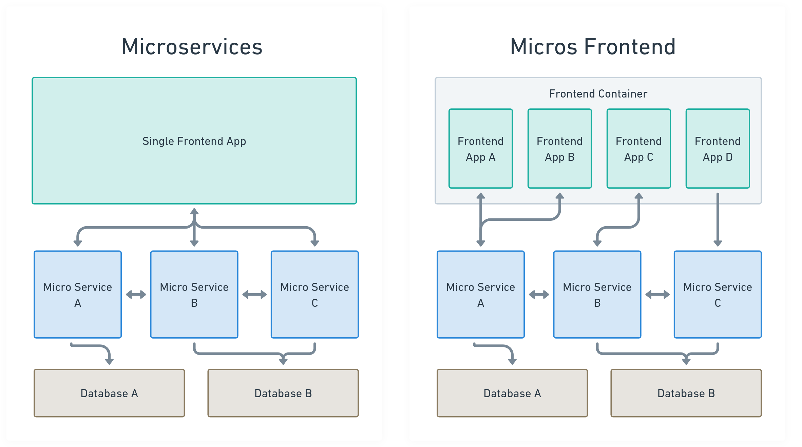
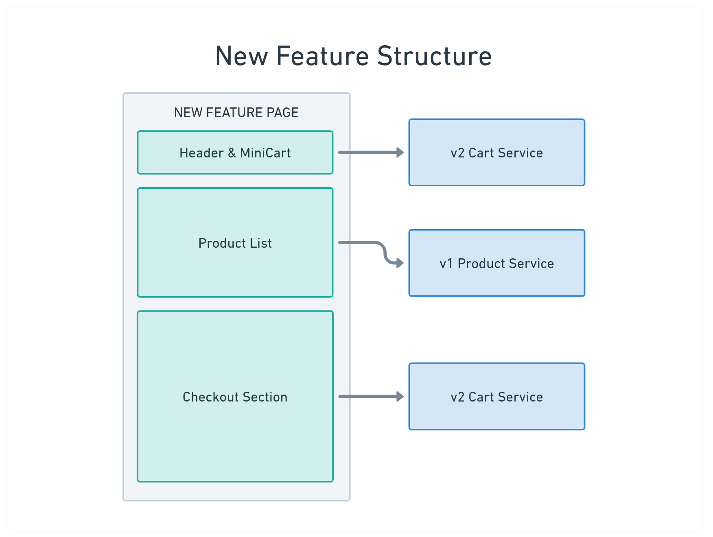

小弟任職前端工程師已有一段不少的時間，其間有幸接手過形形色色、不同規模的專案和應用，由於軟體發展一日千里，除了調節自我、繼續學習新技術外，許多以往常用的技術如今已逐漸式微，甚至被完全淘汰；而小弟目前所在的公司已經營運超過 10 年，具有相當的客群與規模，並且經過歲月的累積，公司的產品逐漸長大，無法避免的讓應用架構變得繁雜、且技術堆疊（tech-stack）也難以撼動，當初的架構已無法滿足需要，新功能的迭代也變得困難重重，因此 Revamp 與 Refactor 便是當務之急。後端伺服器相關的服務，通常會透過不同的 Domain 細分為不同的組別進行開發，並配合「微服務」架構進行重構和開發，以拆分成較小的單位進行；但前端的執行環境都是在客戶端進行，難以拆成小規模的方式進行重構；為了解決這個痛點，我們採用了「微前端」的方式進行了應用的重構，以解決前述的困境。

## 微前端是啥？為什麼需要用它？

所以什麼是「微前端」呢？微前端（Micro-Frontend）是由 *ThoughtWorks* 的技術顧問 *Cam Jackson* 在 2016 年首次提出的。隨著微服務架構在後端開發中的成功應用，開發者開始思考是否能將微服務的設計理念延伸到前端開發，從而引入微前端的概念。

微前端是一種嶄新的前端架構模式，它旨在將原本單一且龐大的前端應用程序分解成更小、更易於管理的獨立部分。熟悉微服務（Micro-Service）的朋友看到這裡，可能覺得這個概念非常相似，實際上微前端的概念就是從微服務架構延伸來的。微服務透過把以往單個龐大的服務，以商業邏輯拆分成不同的域（Domain）進行開發和部署，除了可以專注於各自領域的功能外，也能獨立的部署以及使用各自擅長的 Tech-Stack，主要目的是讓不同團隊能夠獨立開發、測試和部署前端應用的不同部分。微前端使用相同的概念，把以往的 SPA 使用單一個龐大的前端應用，以路由（routing) 或單個頁面區塊的方式拆分成較小的前端應用，以達到各區塊各自使用不同技術進行的開發和分別部署。

以圖例來比較微服務與微前端：



### 微前端實現的三個要點：

* 使用域（Domain）進行實現的切分
* 各應用可以獨立開發和部署
* 使用技術堆疊不受限

## 那麼，要怎樣才能做到微前端呢？

老實說微前端的實作並不複雜，以往部落格常用的 YouTube 嵌入 iframe 就是其中一種，iframe 因為其自帶環境隔離的優點，我司在後台端的應用也經常使用 iframe 的方式進行， iframe 可以說是最佳的實踐方法。而目前主流的微前端有以下三種：

* iframe
* web-component
* Webpack Module Federation

除了前述提及 iframe，web-component 因為主流瀏覽器的支援度，讓其在微前端的實現上受到追捧，而 Webpack Module Federation 旨在解決共用模組重複引用的問題（關於 Webpack Module Federation 的實作方式，可以參考 [微服務很夯，那你有聽過微前端嗎？初探 Micro Frontends 程式架構](https://medium.com/starbugs/%E5%BE%AE%E6%9C%8D%E5%8B%99%E5%BE%88%E5%A4%AF-%E9%82%A3%E4%BD%A0%E6%9C%89%E8%81%BD%E9%81%8E%E5%BE%AE%E5%89%8D%E7%AB%AF%E5%97%8E-%E5%88%9D%E6%8E%A2-micro-frontends-%E6%9E%B6%E6%A7%8B-e0a8469be601) ）

雖然理想很豐滿，但現實往往是骨感的，假如是從頭開始執行微前端架構，大部分可以使用上述方式完成，但想要在現有應用下想要直接套用微前端，則可能會遇上各種各樣的問題要克服。

## 實現微前端時，遇到什麼痛點或困難？

在我司 SHOPLINE 作為電商開店平台，在這次的要實作的新產品，要在現有網店上，在同一頁面中實現商品列表、mini-cart 與結帳流程的功能，在這個前提下如果使用舊有整頁使用同一前端應用進行開發，勢必會一團亂；因而有了以微前端概念進行開發的共識。



### 微前端困難 1 - 現有應用過於龐大，分拆成子應用時不完全

在工程團隊中，小弟主要在負責結帳域相關的功能，為了應付購物平台必須處理的第三方金流和物流處理的網頁跳轉，必須讓應用嚴格的遵守同源政策，因此想要 iframe 的實現方式首先被排除；除此以外，雖然結帳域相對獨立，但為了兼顧商家為品牌形象而自訂義的網站內容，包含網站的主題樣式、以及外包客製團隊實現的額外功能，無法使用 shadow DOM（雖然 shadow DOM 可以透過 `::part` 實現樣式覆蓋，但接口過於侷限，難以完全滿足店家的客製化需求）；並且由於結帳域在原有應用上有部分實現仍然要依賴原應用，因為我們用了較原始的方式來實現微前端 — Node.js package。

其概念是把結帳前端應用使用新專案開發，當中包含頁面以及前端框架的 runtime，透過 Webpack 的多個 entry 執行編譯，以輸出多個 output，最終打包成 tgz 存放至 S3，在主應用中透過套件管理工具（如npm 或 yarn)進行安裝，以單個 output 的方式進行引用和呼叫：

Checkout 模組輸出（示例）：

*checkout.js*

```jsx
import { createRoot } from 'react-dom/client';

function renderCheckout(
  rootEl: Element | DocumentFragment,
  props: IRenderCheckoutProps = {},
) {

  const root = createRoot(rootEl);
  root.render(<Checkout {...props} />);
}

export default renderCheckout;
```

*webpack.config.js*

```jsx
module.exports = function webpack(env, argv) {
	entry: {
	  cart: '/src/entry/cart.js',
	  checkout: '/src/entry/checkout.js',
	},
	// ...
```

網店主應用引入和引用（示例）：

*package.json*

```json
{
  "name": "shopline",
  "dependencies": {
    "@shopline/checkout-module": "https://xxx.s3.amazonaws.com/build/v1.1.tgz",
  }
}
```

*page.js*

```jsx
import { renderCheckout } from '@shopline/checkout-module/checkout';

// 執行後可以渲染出整個結帳區塊
renderCheckout(document.querySelector('#checkout-root'),
	{
	  data: xxx, // 主應用中難以分割的功能作為參數傳入
	}
);
```

使用這種方式雖然違背了「獨立部署」的原則（因為子應用更新後，仍然需要主應用手動升級 package version），在 Checkout 模組中，我仍然能夠使用自訂的技術方案，包含主應用原本無法使用的 TypeScript、React 18、更新的 ES 語法，因此子應用仍然具有 域的切分、獨立開發以及技術堆疊不受限的優點；然而缺點也相當明顯，透過模組方式引入後，無法使用 chunk 的方式切分框架依賴與應用的內容，導致更新後，客戶端都需要從頭載入一大包的 js bundle，雖然這次應用並著重網頁載入的效率，但對於有網頁效能需求的頁面，確實需要有更好的做法。

### 微前端困難 2 - 子應用間溝通模式

除了單一應用的困難外，微前端架構下的子應用之間如果有溝通的需求，或是各應用有複用的資料時，要共用狀態或是切分，也要在開發之前一併考量。在我們的案例中，由於商品列表在加入購物車後，需要通知 mini-cart 與結帳流程有新商品的加入，而 mini-cart 與 結帳流程 間也需要互相知悉購物車最新的狀態，因此需要一個統一的事件溝通方案。

最終我們選擇了使用 CustomEvent 作為應用間的溝通橋樑，讓各個子應用能夠訂閱和觸發事件，以保持資料的一致性。這種方式雖然簡單，但在大型應用中由於有多個團隊並行開發，在開發前先訂定好事件名稱以及命名慣例十分重要。

在微前端的實踐理念中，就有提到在多團隊協作時，應該先確認命名共識與慣例，才能讓不同團隊之間開發項目能夠互相溝通、正常運作。

## 總結 - 微前端是個理想概念，可根據需求調整執行方式

微前端作為一個相對新穎的前端架構模式，其核心理念是將龐大的前端應用分解成更小、更易管理的獨立部分。然而在實際應用中要完全貫彻其理念來執行或許會遇上各式各樣的困難，後來才會發現我們不需要完全遵循所有微前端的原則才能獲得其好處。就如同我們的案例所示，即使採用了較為折衷的實現方式，仍然能夠達到技術堆疊獨立、團隊自主開發的目標，同時解決了現有應用的痛點。最重要的是要根據實際需求和現有架構的限制，選擇最適合的實現方式。

### 參考資料

* [微服務很夯，那你有聽過微前端嗎？初探 Micro Frontends 程式架構](https://medium.com/starbugs/%E5%BE%AE%E6%9C%8D%E5%8B%99%E5%BE%88%E5%A4%AF-%E9%82%A3%E4%BD%A0%E6%9C%89%E8%81%BD%E9%81%8E%E5%BE%AE%E5%89%8D%E7%AB%AF%E5%97%8E-%E5%88%9D%E6%8E%A2-micro-frontends-%E6%9E%B6%E6%A7%8B-e0a8469be601)
* [微前端場景聊聊資源快取問題](https://juejin.cn/post/7181279941210669114)
* [決戰！微前端架構（Micro Frontends in Action](<* https://pjchender.dev/system-design-and-architecture/note-book-microfrontend-in-action/>)